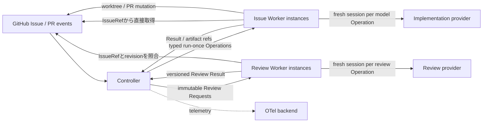

# Architecture

## Boundary model

初期版はmodular monolithとする。Controller、Issue Worker、Review Workerは責務と権限を分離するが、独立したservice、message queue、database、OS processを要求しない。単一Go binary、単一processで実行してよい。

必須なのはprocess分離ではなく、model/provider sessionとmutable contextの分離である。Controllerはmodel sessionを持たず、modelを使う各Worker Operationは必要なcontextだけで新しいsessionを開始する。

本書では、GitHub上の実行単位を`Task Issue`、Run内でWorkerへ委譲する`claim`、`author_tests`、`implement`等を`Worker Operation`と呼ぶ。Task Issueの並行性と、1 Run内のOperation排他を混同しない。



### Issue Worker

実装側の唯一のwriter roleである。Runごとの専用worktree、branch、commit、PRを所有し、test plan、test patch、RED/GREEN証跡を生成する。Issue eventの監視はadapterの責務であり、worker coreはrun-once Operationとして動作する。

最初のclaim Operationはrepository identityとIssue numberを受け取り、IssueをGitHubから直接取得する。Issue本文の代わりにControllerが作った要約を入力にしない。claim後はIssue RevisionとContext Manifestで対象identityを固定し、各model-bearing Operationの開始前に現在のIssueが同じrevisionであることを検証する。

`author_tests`、`revise_tests`、`implement`、`repair_implementation`はそれぞれ新しいprovider sessionを作る。1 Operation内では複数turnとtool実行を許可するが、Operation完了後のconversation transcriptやprovider session IDを次Operationへ渡さない。継続性はcommit、artifact、versioned Resultで表す。

worktree作成、command実行、PR create/updateのような決定論的操作はmodel sessionを必要としない。これらもIssue Workerの権限内で実行し、Controllerが直接mutationしない。

### Review Worker

read-only evaluatorである。`test_validity`と`final_implementation`のReview Requestを処理し、versioned Review Resultを返す。各Review Requestは新しいprovider sessionで評価し、Issue Workerのsession、transcript、mutable worktreeを参照しない。

Review WorkerはRequestのIssueRefを直接取得し、期待するIssue Revisionと一致することを確認する。PR eventは最終reviewを起動する入力の1つだが、test validityはPR作成前にも起動される。そのため、Review Worker coreは「PR監視」ではなく「Review Request処理」として設計する。

### Controller

workflow orchestratorである。Issue dependency graphから実行可能なRunを選ぶschedulerと、各Runのstate、idempotency、retry、lease、artifact reference、許可された状態遷移を管理するRun Controllerを持つ。

Controllerはmodel/provider sessionを持たず、Issueの不足情報を推測したり、Worker向けの自然言語要約を作ったりしない。Worker OperationにはIssueRef、期待revision、commit SHA、Context Manifest、必要なartifact/result digestだけを渡す。Review Resultの形式と対象identityは検証するが、品質判定を上書きしない。

初期実装ではControllerからWorker use caseを同一process内で呼び出してよいが、globalな同期実行を要求しない。独立したRunは別goroutineまたは同等のexecutorで並行実行できる。これはsession共有を意味しない。将来queueや別processが必要になった場合も、typed Operation / Result境界をtransport adapterとして差し替え、state machineへ配送方式を持ち込まない。

Controllerは将来の評価ハーネスとは別物である。前者は1 runを安全に進めるproduction control plane、後者は複数runやsystem variantを比較するexperiment/evaluation planeである。

## Scheduling and concurrency

Task Issueをdependency graphのnode、`dependsOn`を有向edgeとして扱う。parent/sub-issue relationshipは成果階層であり、実行順序のedgeではない。

Task Issueは次をすべて満たすとready candidateになる。

- Issue Contractの`readiness`が`ready`
- `dependsOn`の全Issueがcompletedで、成果物が選択するbaseへ統合済み
- dependency graphにcycleがない
- 同じIssueRefにactiveなRunがない
- claim対象のIssue Revisionとrelationshipが取得中に変わっていない

ready candidate同士にdependency edgeがなければ、同じrepository内でも同時にclaimしてよい。各Runは専用worktree、branch、Operationごとのprovider sessions、artifact lineage、PRを持つ。repository単位のglobal lockで直列化しない。

並行性の不変条件は次の通りである。

- system全体では複数Runをactiveにできる
- 1 IssueRefにactiveなRunは最大1つ
- 1 Runではstateを進めるoperationを同時に1つだけ実行する
- 1 worktreeのwriterは、そのRunのIssue Worker operationだけ
- 異なるRunのIssue WorkerとReview Workerは並行実行できる
- 同じRunがreview待ちの間、そのRunのIssue Workerはheadを変更しない

claim leaseはIssueRef、execution leaseはRun IDまたはworktree identityへscopeする。global leaseを置かない。provider、CPU、API rate limit等による最大並列数は運用上のcapacity policyであり、Issue dependency semanticsを変更しない。capacity不足のready Task Issueはblockedではなくpendingのまま待つ。

## Issue as execution context

Task Issueは実行contextのrootである。IssueRefだけから、Issue Contractが列挙する入力を決定論的に解決できなければならない。

```text
Task Issue
├─ Task自身のOutcome / Scope / Deliverables / AC / Verification
├─ parent                           scopeとtraceability
├─ dependsOn                       readiness gate
└─ authorityRefs                   明示的な実装入力
```

- Task Issue自身が実装境界を完結させる。
- parent Issueの全本文、comment、他のsub-issueを暗黙に継承しない。
- dependency Issueからはcompletion identityを確認し、成果物はbase commitから読む。
- 親、Initiative、dependency本文が実装authorityなら`authorityRefs`へ明示する。
- Initiative、Epic、dependencyのconversationやprovider sessionを実装contextにしない。
- Issue comment、Project metadata、labelを暗黙のauthorityにしない。

例えばEpicが全体のExit、実行順序、sub-issue一覧を持つ場合でも、実装Taskは自身の目的、正本、成果物、Acceptance、検証、対象外、設計判断、停止条件を記述する。Epic自体は実装Taskではなく、各Taskが1 reviewable PRを所有する。

```text
Epic: Package Contract baseline          実装PRなし
├─ Task A: common definitions            ready / dependencyなし / PR A
├─ Task B: package graph                 blocked by Task A / PR B
└─ Task C: validation gate               blocked by Task B / PR C
```

Task Bをclaimするとき、Task AのsessionやIssue本文は引き継がない。Task Aがcompletedで成果物がbase branchへmerge済みであることを確認し、Task Bが`authorityRefs`で示すbase上の成果物を読む。

Context Manifestは解決結果のmanifestであり、Controllerが作る要約ではない。少なくともIssue Revision、base SHA、parent identity、dependency completion、authority reference digestを列挙する。model sessionはIssue本文そのものと、Taskに必要な参照内容を読む。

## Run operation and session workflow

1 Run内のworkflowは次のsession境界を持つ。dependencyのない別IssueのRunは、このsequenceを互いに独立して並行実行できる。

1. ControllerがIssueRefを含むclaim OperationをIssue Workerへ渡す。model sessionは作らない。
2. Issue WorkerがIssueを直接取得し、Issue RevisionとContext Manifestを固定する。
3. Controllerが`author_tests` Operationを発行し、Issue Workerが新規session T1でtestとRED証跡を作る。
4. Controllerが`test_validity` Review Requestを発行し、Review Workerが新規session R1で評価する。
5. `request_changes`なら、findingと固定artifactだけを新規`revise_tests` session T2へ渡す。T1を再開しない。
6. `approve`なら、新規`implement` session I1へ承認済みtest、Review Result、現在commitを渡す。
7. Issue WorkerがGREEN証跡を固定し、modelを使わずPRを作成または更新する。
8. Review Workerが新規`final_implementation` session R2で最終実装を評価する。
9. final `request_changes`は新規repair sessionへ渡し、final `approve`だけを`completed`へ進める。

どのsessionにも前sessionのconversation transcriptを渡さない。Review finding、test patch、commit、command evidenceのように、次Operationが必要とする構造化された成果だけを渡す。

## State and handoff

初期状態機械は、少なくとも次を区別する。

- `claimed`
- `test_authored`
- `awaiting_test_review`
- `implementing`
- `awaiting_final_review`
- `completed`
- `needs_human`
- `failed_transport`

状態遷移の入力は、GitHub delivery ID、run ID、Issue Revision digest、base/head commit SHA、Context Manifest digest、artifact manifest digest、Review Request digestなどの安定したidentityを持つ。再送された同じ入力は副作用を重複させず、Issue Revision、commit SHA、authority reference、artifact digestのいずれかが変われば古いReview Resultを再利用しない。

各Runは独立したaggregateとして保存し、全Runを一つのglobal aggregateやlockで更新しない。Operation実行の意図とResultは状態遷移と別に永続化する。processがOperation中に停止した場合、同じOperation identityから再実行できなければならない。transport/execution failureを品質verdictへ変換しない。

## Isolation

実装とreviewは同一binary、同一OS process内で動かせるが、次を共有してはならない。

- mutable worktree
- model/provider session
- conversation transcriptまたはprocess-local conversational memory
- provider applicationのprivate database
- Controllerだけが所有するworkflow-private state

共有できるのは、versioned Operation / Result protocol、IssueRefと期待revision、immutable artifact reference、明示されたpolicyだけである。

Issue Workerの新しいmodel sessionは、同じrunに属する専用worktreeを引き続き変更できる。ただし継続に必要な状態はworktreeのcommitとartifactへ固定し、前sessionの記憶に依存しない。Review Workerがsource treeを必要とする場合は、Requestのcommit SHAから別のread-only checkoutを再構築する。

## Persistence and telemetry

最初のstorageは、明示的なinterfaceの背後にあるローカルfilesystemでよい。Runごとのcompare-and-swapまたは同等のatomic updateと、IssueRef / Run IDへscopeしたleaseを提供する。artifactはcontent-addressedにし、workflow metadataとartifact本体を分離する。databaseは並行数や運用要件がfilesystem実装の制約を超えてから選ぶ。

Issue本文、parent/dependency identity、authority reference contentは取得元を正とし、保存したRevision/Manifestはlineageと再現性の証拠として扱う。保存済みartifactを使って、変更後のlive Issueを変更前のものとして装わない。

OTel trace、log、metricは観測と後日の分析に使えるが、workflowを復元するための唯一の記録にはしない。外部OTel側へ評価機能を置くかは、評価単位とクエリ要件を決めた後に判断する。

## Expected Go layout

コードが必要になった時点で、次の責務単位を追加する。空のpackageは先に作らない。

```text
cmd/kudo/              CLI entrypoint
internal/contract/     strict Issue and protocol validation
internal/controller/   state machine and idempotent transitions
internal/issueworker/  implementation-side use cases
internal/reviewworker/ read-only review use cases
internal/artifact/     immutable artifact store
internal/github/       GitHub adapters
```
