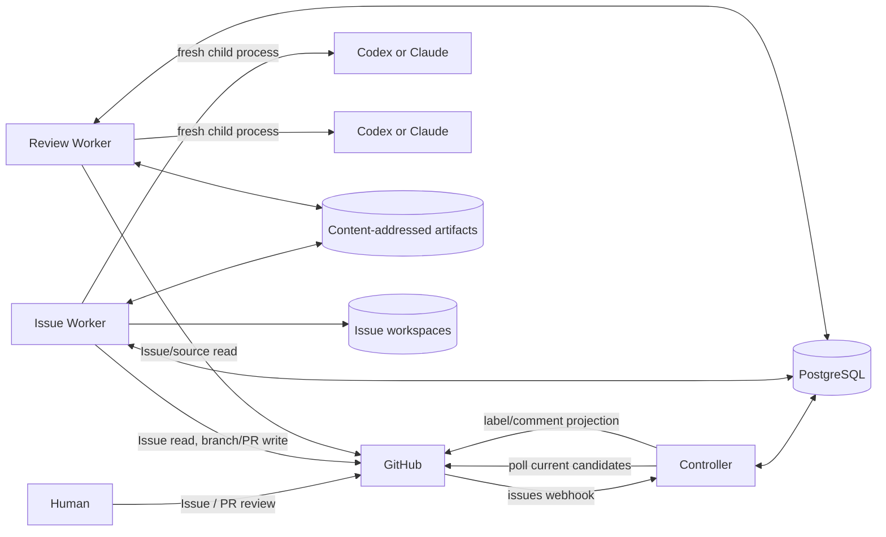
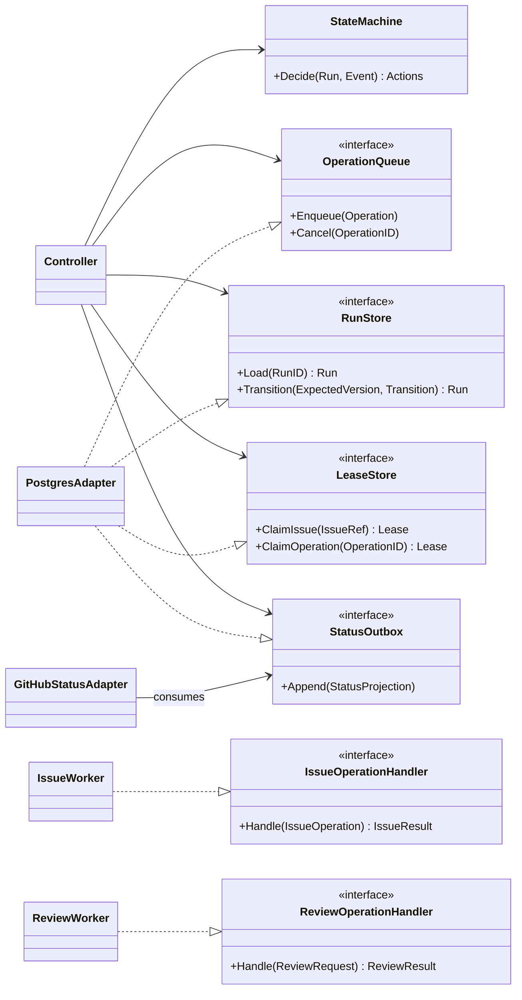
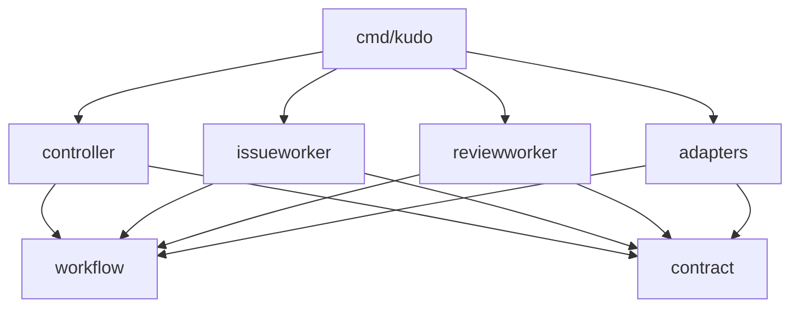

# Architecture

## Architectural style

Kudo は一つの Go module と一つの deployable binary を持つ modular monolith である。同じ binary を起動 mode によって Controller、Issue Worker、Review Worker、migration job として実行し、Docker Compose 上では役割別 container に分離する。

論理 boundary と deployment boundary を区別する。

- Go package と consumer-owned interface が compile-time の責務境界を作る。
- PostgreSQL 上の versioned Operation / Result が runtime の通信境界を作る。
- Compose service が process、filesystem、credential、resource の権限境界を作る。
- Task Issue、immutable artifact、commit SHA が model session 間の context 境界を作る。

Controller が Codex や Claude を直接操作するのではない。Controller は versioned Execution Policy を Run に固定し、次に許可された [Worker Operation](contracts/operation-protocol-v1alpha1.md) を durable queue へ記録する。該当 Worker が Operation を lease し、policy が指定する provider process を起動する。

## System context



PostgreSQL は workflow state の正本、GitHub は live Issue/repository/PR の正本である。artifact volume は immutable evidence の bytes を保持する。OTel や log backend は観測用であり、いずれの正本も代替しない。

## Component responsibilities

### Controller

Controller は control plane であり、次を所有する。

- GitHub webhook の HTTP ingress と署名検証 adapter の起動
- startup reconciliation と既定60秒ごとの fallback polling
- webhook/polling を集約する冪等な`ReconcileIssue`
- Run state machine と許可された transition の検証
- Issue/Run scoped lease と concurrent capacity の調停
- versioned Worker Operation と Review Request の dispatch
- timeout、retry、stale input、escalation の routing
- transactional outbox による GitHub label/comment projection

Controller は model/provider session を持たず、Issue の不足情報を補う prompt を作らない。Review Result の schema、request binding、staleness は検証するが、reviewer の品質 verdict を approve に変更しない。

Controller が行える GitHub mutation は、durable state を正本にした Issue label/comment の status projection に限る。worktree、branch、commit、Pull Request は変更しない。

### Issue Worker

Issue Worker は implementation data plane であり、実装側の唯一の writer role である。

- live Issue、native relationship、dependency、authority、base を取得して claim evidence を作る
- Run 専用 workspace、worktree、branch、checkpoint commit を管理する
- test authoring/revision、RED command、implementation/repair、GREEN/refactor checks を実行する
- model-bearing Operation ごとに fresh Codex/Claude process を supervision する
- artifact manifest と command evidence を content-addressed store へ追加する
- approved head の branch push と Pull Request create/update を冪等に行う

同じ Run の新しい Operation は同じ専用 worktree を引き継げる。ただし継続に必要な状態は commit と artifact へ固定し、前 provider session の transcript、session ID、private memory に依存しない。

### Review Worker

Review Worker は read-only evaluator である。

- `test_validity`と`final_implementation`の Review Request を処理する
- request が指す Issue Revision と live Issue の digest を照合する
- head SHAとimmutable source bundle/snapshot artifactからdisposable checkoutを構築する。既にread-only remoteで取得可能な同一commitは再利用してよい
- immutable artifact と明示された policy だけを fresh provider session へ渡す
- versioned`approve`、`request_changes`、`needs_human` Result を返す

Review Worker は implementation workspace volume を mount せず、GitHub write credential を持たない。Review Result artifact の新規追加と Operation Result の記録はできるが、受け取った artifact、source、branch、PR は変更できない。

### GitHub adapters

GitHub 固有処理は薄い adapter とし、次を application operation から分離する。

- webhook signature と payload parsing
- Issue/relationship/dependency/repository content read
- candidate search pagination と rate-limit handling
- label/comment projection
- branch、commit、Pull Request API
- GitHub App installation token の発行

Webhook adapter と poller は business rule を持たず、いずれも`ReconcileIssue`を呼ぶ。Issue Worker の claim は event payload ではなく live API response を使う。

### Provider and process adapters

Codex と Claude は共通の Operation contract を実装する交換可能な adapter である。adapter は provider ごとの CLI invocation、structured output parsing、timeout、signal、exit status、stdout/stderr capture を担当する。

deployment は Issue Worker 用と Review Worker 用の provider を明示的に設定する。同じ provider を選んでもよいが、fresh session、read-only review context、credential/workspace分離は緩和しない。Controllerはprovider/model/adapter versionとtimeout/tool policyをExecution Policy snapshotとして固定し、OperationとReview Requestをそのdigestへbindする。Issue本文からproviderを推測しない。

provider を呼ぶたびに新しい process と operation-scoped state directory を作る。前 Operation の resume token、conversation database、transcript を渡さない。認証 material は read-only secret から供給し、成果として保存しない。

### Persistence and artifact adapters

PostgreSQL adapter は Run、Operation、lease、inbox、outbox、review binding、projection を transaction と constraint で保護する。queue は PostgreSQL 内に置き、Redis、NATS、RabbitMQ を追加しない。

Artifact Store は logical metadata と bytes を分ける。bytes は SHA-256 を key にした write-once layout へ保存し、同じ digest への異なる bytes を拒否する。Issue Worker と Review Worker は新しい artifact を追加できるが、既存 artifact を上書きまたは削除できない。

## Application boundaries

interface は原則として利用側 package に置く。Controller は大きな`Worker` interface ではなく、実際に dispatch する小さな capability と store interface に依存する。



Runtime transport は interface の method call を模倣する必要はない。PostgreSQL queue の payload は [Worker Operation Protocol](contracts/operation-protocol-v1alpha1.md) のversioned envelopeとし、workerはkindごとのschemaをstrictに検証する。unknown versionやfieldを暗黙に解釈しない。

## Durable model

最低限、次の aggregate/record を永続化する。正確な table schema は migration と code で version 管理する。

| Record | Identity / invariant |
| --- | --- |
| Issue candidate | repository + Issue number。発見結果であり execution authority ではない |
| Run | Run ID。1 IssueRef にwriter-capableなRunは最大一つ。paused Runのresumeまたはsupersedeもtransactionで排他する |
| Run transition | Run ID + monotonic version。compare-and-swap で順序を保つ |
| Operation | stable Operation ID、kind、input digest。Run 内で同じ logical action を重複生成しない |
| Attempt | Operation ID + attempt number。lease、heartbeat、timeout、failure を記録する |
| Inbox | GitHub delivery ID または poll trigger identity。重複 event を吸収する |
| Outbox | projection identity。state commit と同じ transaction で作成する |
| Review binding | request digest と result digest。入力変更時に stale と判定する |
| Execution Policy | provider/model/adapter version、tool/timeout policyのdigest。Run途中で暗黙に変更しない |
| Artifact metadata | digest、media type、length、producer、created time。bytes は volume に置く |

Operation は少なくとも`queued`、`leased`、`succeeded`、`retry_wait`、`failed_terminal`を区別する。Run phase と transport failure を同じ enum に押し込まない。

## Queue, lease, and recovery

Controller は transition と次 Operation の enqueue を同じ transaction で確定する。Worker は対象 role の queued Operation を transaction 内で lease し、heartbeat を更新する。正常終了時は Result digest と terminal status を一度だけ記録する。

process crash または network partition で lease が失効した場合、reaper が Operation を再度 eligible にする。新しい attempt は以前の provider process を resume せず、確定済み input artifact から fresh session を作る。外部 mutation の前後には idempotency identity を保存し、GitHub の現在値を照合して二重 branch/PR/comment を防ぐ。

retry policy は error class ごとに決める。

- timeout、rate limit、一時的な network/provider failure: exponential backoff と jitter で retry
- invalid provider output: bounded retry 後に execution failure として記録し、品質 verdict には変換しない
- contract/authority conflict、安全判断: `needs_human`
- review の blocking finding: `request_changes`として修正 Operation へ routing
- changed Issue/head/artifact: stale。新しい identity で再評価し、古い approval は破棄

## Scheduling and concurrency

Task Issue を dependency graph の node、`dependsOn`を readiness edge として扱う。parent/sub-issue relationship、Issue 番号、Project phase から暗黙の順序を作らない。

- dependency のない ready candidate は同時に active Run になれる。
- 1 IssueRef に writer-capable な Run は最大一つ。`needs_human`からの resume/supersede も同じ排他制約を通す。
- 1 Run の state-advancing Operation は同時に一つ。
- 1 worktree の writer はその Run を lease した Issue Worker だけ。
- review 中は対象 head を変更しない。
- provider/CPU/GitHub rate limit による capacity 待ちは dependency blocked ではない。
- repository 全体を直列化する global lock を置かない。

Controller replica、Issue Worker replica、Review Worker replica を増やしても、PostgreSQL constraint と scoped lease が同じ invariant を維持する。Compose の単一 host deployment を標準とするが、同時実行数を一つに固定しない。

## Context and session isolation

Task Issue が execution-context root である。

```text
Task Issue
├─ Task自身の Outcome / Scope / Deliverables / AC / Verification
├─ parent                           hierarchyとtraceabilityのみ
├─ dependsOn                       readiness gateのみ
└─ authorityRefs                   明示された実装入力
```

parent、dependency、Issue comment、Project field、provider conversation は、Task が authority として明示しない限り session context に入れない。Context Manifest は解決結果の一覧であり、Controller が作る自然言語要約ではない。

Implementation と Review が共有できるのは次だけである。

- versioned Operation / Review protocol
- IssueRef と期待 Issue Revision
- base/head commit SHA
- Context Manifest と immutable artifact reference
- versioned Review Result と明示された policy

次は共有しない。

- mutable worktree
- provider session、resume token、conversation transcript
- provider application の private state
- Controller の application-private memory
- Issue Worker の write credential

## Mutation authority

| Resource | Controller | Issue Worker | Review Worker |
| --- | --- | --- | --- |
| Run/Operation transition | validate/record | resultを返す | resultを返す |
| GitHub Issue body | no | no | no |
| GitHub label/comment | durable projectionのみ | no | no |
| implementation worktree | no | read/write | no mount |
| branch/commit | no | read/write | read-only checkout |
| Pull Request | no | create/update | read-only |
| input artifact | no overwrite | read | read |
| new evidence/result artifact | metadataをroute | append | append |
| review verdict | no override | no | create |

## Go package layout

top-level の`pkg/`や`package/` directory は作らない。Kudo は外部 module 向け library API を提供しないため、implementation package は`internal/`へ置く。Go では各 directory 自体が package boundary であり、視覚的な分類だけを目的に深く nest しない。

目標 layout は次のとおりである。空 directory を先に作らず、対応する code と test を実装する milestone で追加する。

```text
cmd/
└─ kudo/                     CLI、role command、composition root
internal/
├─ contract/                 Issue/Review/Operation schema、strict parse、canonical digest
├─ workflow/                 Run aggregate、pure transition、error/result taxonomy
├─ controller/               reconcile、dispatch、retry、projection use caseと利用側interface
├─ issueworker/              claim、test、implement、workspace/PR use case
├─ reviewworker/             read-only review use case
├─ artifact/                 content-addressed store contract
├─ adapter/
│  ├─ postgres/              Run store、queue、lease、inbox/outbox、migration
│  ├─ github/                webhook、polling、reader、status、PR adapter
│  ├─ gitworkspace/          clone/worktree/commit/command boundary
│  └─ provider/
│     ├─ codex/              Codex headless process adapter
│     └─ claude/             Claude headless process adapter
└─ telemetry/                structured log、metric、trace adapter
```

依存方向は次を守る。



- `cmd/kudo`だけが concrete adapter を組み立てる。
- `controller`は`issueworker`、`reviewworker`、provider の concrete package を import しない。
- adapter は application/domain package が定義した小さい interface を実装する。
- interface は mock のために先回りせず、利用側で複数実装または fake が必要になった時点で定義する。
- test fake は原則として利用側の`_test.go`に置き、production package に汎用`memory.go`を増やさない。
- package 内の file は use case 単位で平らに置いてよい。独立 API と明確な import boundary が生じた場合だけ subpackage に分ける。

## Telemetry

Run ID、Operation ID、attempt、IssueRef、state transition、duration、provider、token/cost、artifact digest、verdict を structured log と trace/metric に出せるようにする。secret、Issue の非公開本文、provider transcript、source bytes を既定で telemetry へ送らない。

Telemetry backend の欠落や sampling は workflow correctness に影響させない。復旧に必要な state と lineage は PostgreSQL と Artifact Store に残す。
