# 02. 信頼性・証跡戦略

Kudo における品質は、最終的な code diff が動くことだけではない。何を入力として、どの test と
review を通り、どの commit を人間へ渡したかを後から検証できることまでを品質に含める。

本書はそのための設計戦略をまとめる。個別 field は [contracts/](../05_design/contracts/)、規範的な順序は
[End-to-end workflow](../05_design/02_workflow.md)、責務と権限は [Architecture](../05_design/01_architecture.md) を正とする。

## 1. Explicit contract

Task Issue を execution context の root とする。Issue Author は Outcome、Scope、Deliverables、
Acceptance Criteria、Verification、Constraints、Decision Authority、Stop Conditions を明示する。

- required input が欠落または曖昧なら推測しない。
- parent は hierarchy、dependency は readiness gate として扱い、prose を暗黙に継承しない。
- 実装入力にする参照だけを `authorityRefs` で明示する。
- live Issueのexact bodyは保存せず、Issue Observation ref/body digestとstrict parse後のTask Context digestを分けて固定する。

これにより、GitHub 上の監査対象と model に渡す実行仕様を混同せず、同じ入力から同じ identity を
再現できる。

## 2. Test-first quality gate

Kudo は次の順序を変更しない。

```text
Issue Contract
  -> test plan / test code
  -> RED evidence
  -> test validity review
  -> implementation / refactor
  -> GREEN + required checks
  -> final implementation review
  -> reviewable Pull Request
  -> approved-head merge + Issue close
```

RED は単なる command failure ではない。対象 behavior が未実装であることに起因する、期待どおりの
failure でなければならない。環境故障、無関係な既存 failure、compile infrastructure failure を
RED として扱わない。

test validity が承認された後だけ implementation を開始する。実装中に test の変更が必要になった
場合は、その場で書き換えて続行せず、test authoring と review の gate へ戻る。

## 3. Independent and fresh review

実装と review は同じ provider を利用してもよいが、次を共有しない。

- mutable worktree
- provider session、resume token、conversation transcript
- application-private memory
- Issue Worker の write credential

各model-bearing Operationはfresh sessionで開始し、必要なcontextはlive Issueから再生成して期待digestと
一致したcanonical Task Context、commit、immutable evidence artifact、versioned Review Resultとして明示的に渡す。Review Workerはdisposable
な read-only checkout から判定し、Controller や Issue Worker は verdict を上書きできない。

## 4. Immutable evidence と freshness

期待input identityはPostgreSQLへ固定し、再取得できない主要な証跡だけをcontent-addressed artifactとして
保存してReview Requestを入力digestへbindする。raw Issue body、Issue Observation、Task Context、Context
ManifestのYAMLは保存しない。

```mermaid
flowchart LR
    GH[Live GitHub Issue] --> IC[Issue Compiler]
    IC --> TC[In-memory Task Context]
    TC --> CM[Context Manifest identity]
    CM --> TP[Test plan / patch]
    TP --> RED[RED evidence]
    RED --> TR[Test Review Result]
    TR --> HEAD[Implementation head]
    HEAD --> GREEN[GREEN / checks evidence]
    GREEN --> FR[Final Review Result]
    FR --> PR[Reviewable PR]
    PR --> MG[Compare-and-merge + merged observation]
```



Context Manifest、Execution Policy、head commit、Artifact Manifest、policy reference のいずれかが
変われば、以前の review result は stale になる。Issue Observation だけが変わり、canonical Task
Context と Context Manifest が同一なら、その変化は audit lineage への追記であり approval を
stale にしない。

## 5. Durable execution と冪等性

PostgreSQL を Run、Operation、attempt、lease、inbox、outbox、review binding の authoritative
workflow store とする。GitHub label と comment は durable state の投影であり、workflow の正本ではない。

- webhook と polling は同じ冪等な reconciliation へ集約する。
- logical Operation と execution attempt を分け、retry で provider session を再利用しない。
- transition と次 Operation / projection intent を同一 transaction で記録する。
- branch、commit、Pull Request の mutation 前後で期待値と live state を照合する。
- lease失効後はstructured claim contextとlive GitHub/sourceから別attemptがcontextを再構築する。

transport failure、protocol validation failure、quality verdict は別の結果として保持する。
通信失敗を `request_changes` に変換せず、review finding を retry 対象の通信失敗として扱わない。

## 6. Bounded autonomy と escalation

`request_changes` の自動修正 loop には、`test_validity`と`final_implementation`それぞれに独立した
round 上限を置く。上限は品質基準ではなく、無人区間を有限にする Controller の gate policy である。

上限到達、安全判断、authority conflict、外部干渉などでは、停止 phase、理由 code、evidence、
必要な人間の対応を記録して `needs_human` にする。人間が内容を確認して `ai-ready` を再度付けた
場合にだけ、安全な resume または新しい Run への supersede を選ぶ。

## 7. Scoped concurrency と最小権限

dependency のない Issue は、Issue / Run scoped lease と専用 workspace で並行実行できる。
repository global lock は置かない。一方、同じ Issue に writer-capable な Run を二つ作らず、
一つの worktree を同時に複数 Worker が変更しない。

権限も role ごとに分ける。

| Role | 許可する主な mutation |
| --- | --- |
| Controller | Run transition と GitHub status projection |
| Issue Worker | implementation worktree、branch、commit、Pull Request |
| Review Worker | 新しい review evidence / result の追加のみ |

Controller と Review Worker へ Issue Worker workspace や Docker socket を渡さず、artifact の共有は
content-addressed かつ immutable に限定する。
