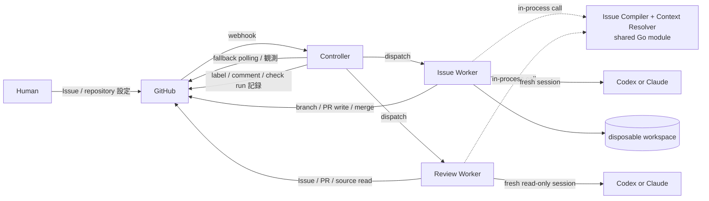

# 03. システム仕様

Kudo の完成形を、プロダクト全体の視点から示す中央仕様である。Kudo は、定型 GitHub Issue を
入力として、独立した test validity review を含む TDD を実行し、証跡付き Pull Request を承認済み
head のまま base へ merge する、単一 host 向けの issue-to-merge runtime である。

本書は system-wide なアクター、要求、構成、不変条件を所有する。厳密な field や遷移を本書へ
複製せず、次の正本へ委譲する。

- protocol field と canonical identity: [contracts/](../05_design/contracts/)
- workflow の順序と state transition: [End-to-end workflow](../05_design/02_workflow.md)
- component の責務と権限: [Architecture](../05_design/01_architecture.md)
- deployment / operations contract: [Runtime platform](../05_design/03_runtime-platform.md)
- GitHub 上の candidate と status: [GitHub routing policy](../05_design/04_github-routing.md)
- 実装状況と delivery order: [Implementation plan](../06_project/01_implementation-plan.md)

## 1. プロジェクト概要

人間が完成した Task Issue に assignee `mrbaron3` と `ai-ready` label を付けると、Kudo は live
GitHub state を検証して Run を開始する。test を先に作り、その test の妥当性を独立 reviewer が
承認した後にだけ実装へ進む。最終実装も別の read-only review を通し、同じ head に対する証跡を
Pull Request へまとめたうえで、その head を base へ merge し、Task Issue を close する。

Kudo は webhook 欠落、重複 event、process restart、provider failure、複数 Issue の同時実行を
通常の運用条件として扱う。process-local memory や会話履歴を workflow の正本にしない。

## 2. アクター

| アクター | 責任 |
| --- | --- |
| Human Author | Issue Contract、authority、受け入れ条件を確定し、`ai-ready`で実行を依頼する |
| Repository Owner | branch protection、required check、merge 対象 base branch で Kudo の merge 境界を設定し、merge 後の release / revert を判断する |
| Controller | candidate reconciliation、phase 導出、Operation dispatch、retry / escalation、label / comment / check run の記録を行う |
| Issue Worker | live Issue のcompile、claim、test、implementation、worktree、branch、Pull Request mutation を所有する唯一の writer |
| Review Worker | live Issue のcompile結果と独立checkoutからtest validity / final implementation verdictを返す |
| GitHub | live Issue、repository、branch、Pull Request の source of truth であり、workflow 状態の唯一の永続表現（record surface） |

## 3. システム構成

Kudo は一つの Go module、一つの deployable binary、一つの OS process で動く stateless reconciler と
する。Controller、Issue Worker、Review Worker は同一 process 内の role であり、権限境界は role-scoped
GitHub credential と fresh provider child process で作る（[ADR-0001](../../adr/0001-github-ssot-stateless-reconciler.md)）。



この図は role boundary と、両Workerが使う共通componentを重ねて示す。Issue Compiler +
Context Resolverのnodeは通信先serviceではなく、同じGo moduleが各Worker processにcompileされることを表す。
Issue Contractの意味解析はIssue Compilerだけが所有し、ControllerはIssueを解釈しない。claim時に期待digestを固定し、後続Operationはlive Issueを
再取得して同じCompilerでcanonical表現を再生成し、期待digestとの一致を確認する。component間の詳細は
[Architecture](../05_design/01_architecture.md)を正とする。

### 3.1. 採用構成

| レイヤー | 採用 | 役割 |
| --- | --- | --- |
| 言語 / binary | Go、単一 module / binary | domain、application、adapter を compile-time boundary で分ける |
| Contract compilation | pure Issue Compiler component | 各Operationでverified Issue identityとlive raw bodyからcanonical Task Contextを決定論的に再生成する |
| 実行基盤 | 単一 container（Compose は packaging） | 単一 process の stateless reconciler |
| Workflow state | GitHub の record surface | branch、PR、check run、comment、label から phase を導出する |
| Evidence / verdict | App 所有 check run と marker comment | commit SHA へ束縛し、gate 判定は check run の digest を正とする |
| Workspace | disposable な local filesystem | Run ごとの clone / worktree。失われたら再構築する |
| Source / collaboration | GitHub / GitHub App | Issue、repository、Pull Request と role-scoped access |
| Model provider | Codex または Claude の child process | Operation ごとに fresh session で test、実装、review を行う |
| Telemetry | structured log、metric、trace | 診断と改善に使うが workflow state の正本にはしない |

採用理由は [ADR-0001](../../adr/0001-github-ssot-stateless-reconciler.md)、secret / credential の
厳密な境界は [Runtime platform](../05_design/03_runtime-platform.md) を正とする。

### 3.2. 権限境界

- Controller は model session と implementation worktree を持たない。
- Issue Worker だけが implementation worktree、branch、commit、Pull Request を変更できる。
- Review Worker は implementation workspace を参照せず、GitHub write credential を持たない。
- Docker socket を mount しない。
- Worker 間では mutable state や conversation を共有せず、claim checkpoint の digest、versioned
  message、record surface 上の digest 検証済み payload を渡す。

## 4. 機能要件

### F-01. Issue の検出と reconciliation

- GitHub webhook を低遅延の通知経路として受け付ける。
- startup 時と既定 60 秒ごとの polling で webhook の欠落を回復する。
- webhook と polling を同じ冪等な `ReconcileIssue` operation へ集約する。
- open、non-PR、assignee `mrbaron3`、label `ai-ready`を満たす Task Issue だけを候補にする。

### F-02. Contract 検証と claim

- Issue Worker の deterministic claim handler が live GitHub API から Issue を取得する。
- pure な Issue Compiler だけが verified Issue identity と raw body を strict parse し、Issue Observation、
  canonical Task Context、Claim Requirements を生成する。
- Context Resolver が Claim Requirements に従って relationship、dependency、authority、base commit を
  live source から解決し、Context Manifest identityを計算する。
- claim成功時はCompiler version、Issue Observation / Task Context / Context Manifestのref、body digest、base SHAを
  claim checkpoint（draft PR bodyのmachine block）へ固定する。canonical YAMLやraw Issue bodyは保存しない。
- 各後続Operationはlive Issueとauthorityを再取得し、Task ContextとContext Manifestをメモリ上で再生成して
  checkpointと比較する。一致したcanonical Task ContextだけをそのOperationのmodel inputとして使う。
- Controller は Compiler の結果を再解釈せず、deployment configuration から Execution Policy を固定する。
- required input の欠落、曖昧さ、authority conflict を推測で補わない。
- dependency が未完了の Issue は readiness gate で待機させる。

### F-03. Test authoring と RED

- fresh provider session で Acceptance Criteria に対応する test plan と test code を作る。
- test-only head で対象機能の未実装に起因する RED を確認する。
- test plan、patch、command、exit status、出力、environment identity を immutable evidence にする。
- RED 固定後、test-only head を draft Pull Request へ publish する。

### F-04. Test validity review

- publish 済み draft Pull Request の exact head / base / open state を live に照合する。
- Review Worker が別 checkout と fresh read-only session で test の妥当性を評価する。
- `approve`まで production implementation を開始しない。
- `request_changes`は finding を immutable result として新しい `revise_tests` session へ渡す。
- `needs_human`または round 上限到達時は自動 loop を停止する。

### F-05. GREEN、refactor、検証

- test validity で承認された test を入力として fresh implementation session を開始する。
- 承認済み test を変更せずに production code を実装し、GREEN を固定する。
- behavior を保って refactor し、Issue Verification と repository required checks を再実行する。
- test 変更が必要なら test gate へ戻し、implementation 中に承認対象を差し替えない。

### F-06. Final implementation review

- final head を同じ draft Pull Request へ publish してから review を開始する。
- Review Worker が correctness、regression、scope、test quality、code quality、security、evidence を
  versioned policy に基づいて評価する。
- `request_changes`は fresh `repair_implementation` session へ渡し、変更後の head を再 review する。
- head、artifact、policy reference など semantic input が変われば、以前の approval を stale にする。

### F-07. Pull Request の確定と merge

- final approval、refactor 後の required checks evidence、live Pull Request head が同じ commit に bind された場合だけ draft を解除する。
- Pull Request body に Task Issue、Acceptance Criteria、RED / GREEN / checks、二つの Review Result、
  residual risk、Run / base / head identity を含める。
- final approve、live head 一致、required status check の success、mergeable がすべて成立する場合だけ、
  期待 head SHA を明示した compare-and-merge で merge commit を作り、head branch を削除する。
- merge completion を durable に記録した後、Task Issue を close し、`ai-merged`へ投影する。
- required check failure、conflict、branch protection の拒否は `merge_blocked`として停止し、設定の回避や
  squash / rebase での強行を行わない。
- release、deploy、merge 後の revert 判断は実行しない。

### F-08. Recovery と escalation

- transport / provider の一時障害は error class に応じて bounded retry する。
- process crash 後は、確定済み input から fresh attempt を開始する。
- human decision、authority conflict、外部干渉、attempt retry / review round 上限到達、immutable protocol validation failureでは `needs_human`へ遷移する。
- 停止理由、evidence、必要な対応を日本語の status comment と durable record に残す。
- 人間による `ai-ready`再付与後にだけ、安全な resume または supersede を行う。

### F-09. Dependency と並行実行

- `dependsOn`だけを readiness edge として扱い、parent や Issue 番号から暗黙の順序を作らない。
- dependency のない ready Issue は、独立した Run と workspace で同時実行できる。
- 同じ Issue に writer-capable な Run を二つ作らない。
- capacity 待ちを dependency blocked として扱わない。

## 5. 標準 workflow

```text
Issue ready
  -> claim
  -> author tests
  -> RED evidence
  -> draft PR publish
  -> test validity review
  -> implement + GREEN + refactor
  -> final head publish
  -> final implementation review
  -> PR ready
  -> merge + branch 削除
  -> Issue close
```

review の `request_changes`は該当 gate 内で fresh correction session と再 review を繰り返す。
retry、stale、transport failure は review verdict と別に扱う。規範的な分岐と durable state は
[End-to-end workflow](../05_design/02_workflow.md) を正とする。

## 6. 主要な情報と証跡

| 情報 | 役割 |
| --- | --- |
| Issue Observation | GitHubから取得したIssue identityとexact body digestの監査lineage。raw bodyは保存しない |
| Task Context | 各Operationでlive Issueから生成するstrict parse済みcanonical representation。claim checkpointにはschema・Compiler version・期待digestだけを固定する |
| Context Manifest | Task Context、base、dependency completion、authority contentから再計算する解決identity。claim checkpointに期待refを固定し、canonical YAMLは保存しない |
| Execution Policy | provider、model、adapter version、tool / timeout policy の Run snapshot |
| Escalation Policy | attempt retry と gate ごとの review round 上限を固定する Controller policy |
| Record surface payload | test plan、command evidence など、check run / comment へ digest 付きで記録される payload |
| Review Request / Result | review input identity と versioned verdict / finding の binding |

schema と staleness rule は [contracts/](../05_design/contracts/) を正とする。

## 7. 非機能要件

### 7.1. Recoverability

workflow の継続に必要なstateをprocess-local memoryに置かない。processのrestart後に、claim checkpoint、
live GitHub、commit、record surfaceのevidence / verdictから同じphaseを再導出してretryまたは再開でき
なければならない。live sourceがcheckpointの期待digestと一致しなければ再開せずstaleとする。

### 7.2. Idempotency

duplicate、遅延、順不同 event、ambiguous external response が、二重 Run、二重 branch、二重 Pull
Request、二重 comment を作らない。排他は GitHub の CAS、記録の冪等性は marker で保証する。

### 7.3. Security と isolation

role ごとに filesystem と credential を最小化する。secret、非公開 Issue body、provider transcript、
source bytes を既定で telemetry へ送らない。Review Worker が implementation mutation を実行できない
ことを deployment boundary でも保証する。

### 7.4. Deterministic validation

GitHub、process、clock、filesystem、provider、telemetry の境界は fake で決定論的に test できるようにする。
live integration は opt-in とし、core correctness の唯一の証拠にしない。

### 7.5. Concurrency

repository 全体を global lock で直列化しない。Issue scoped な branch claim により、独立 Issue の
同時実行と、同一 Issue / worktree の writer 排他を両立する。

### 7.6. Operability

Run ID、Operation ID、attempt、IssueRef、transition、duration、provider、artifact digest、verdict、
review round、escalation reason を構造化して観測できるようにする。ただし telemetry backend は
workflow correctness と復旧の正本にしない。

### 7.7. Deployability

単一 container で単一の Go binary を実行する。health / readiness と graceful shutdown を運用 contract に
含める。backup は不要である（正本は GitHub にある）。

## 8. アーキテクチャ上の不変条件

- Task Issue だけを execution-context root とする。
- test validity approval より前に production implementation を開始しない。
- implementation role は自身の test または実装を approve できない。
- Issue Worker 以外は implementation worktree、branch、Pull Request を変更しない。
- model-bearing Operation ごとに fresh provider session を開始する。
- session 間では会話履歴ではなくclaim checkpointに固定したinput digest、live sourceから再生成した
  canonical context、digest検証済みevidence payload、versioned resultを渡す。
- transport failure と review verdict を同じ結果として扱わない。
- semantic input が変わった review approval を再利用しない。
- approve された head と一致しない head を merge しない。
- Kudo 自身の merge intent に紐付かない close / merge を、自分の mutation の成功として扱わない。
- GitHub label / comment と telemetry を authoritative workflow state にしない。
- dependency のない Issue を repository global lock で直列化しない。

## 9. 対象外と実装状況

製品境界は [01. プロダクト設計](../01_product-design/) §5 を参照する。本書は完成形の仕様であり、
現在の repository status を表さない。実装済みの milestone と未実装 component は
[Implementation plan — Current status](../06_project/01_implementation-plan.md) を正とする。
