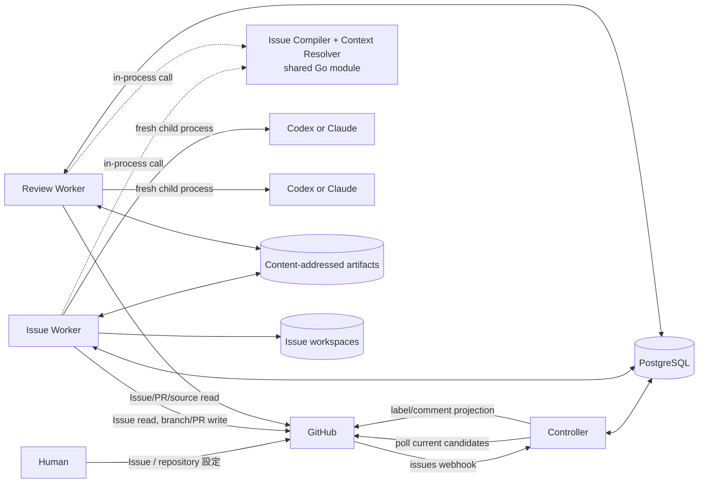
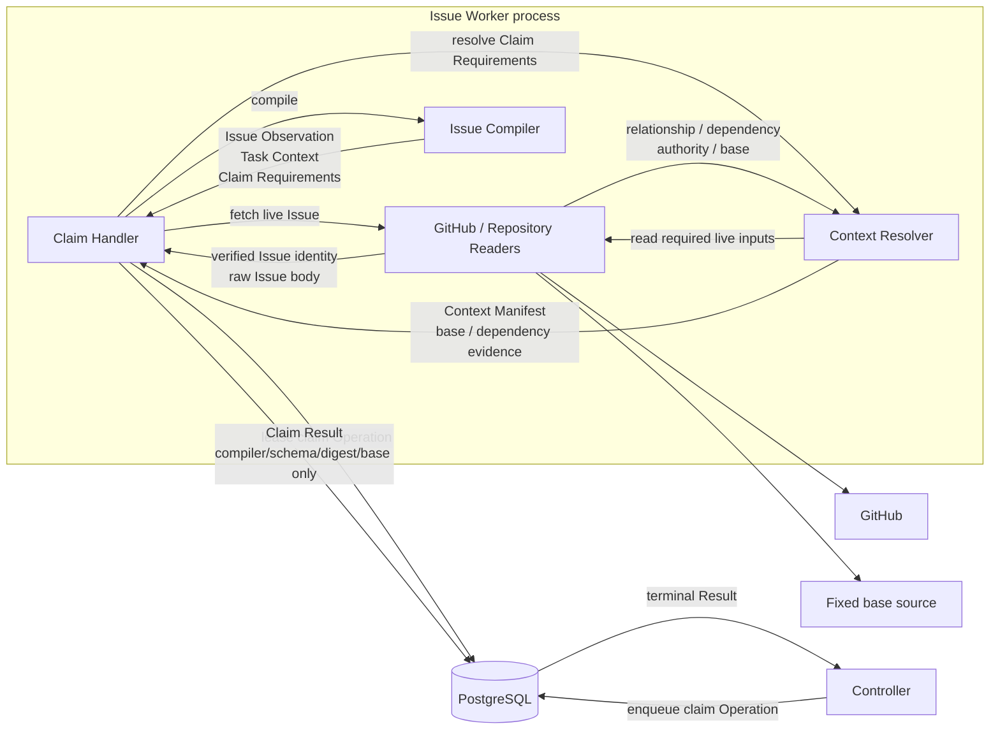
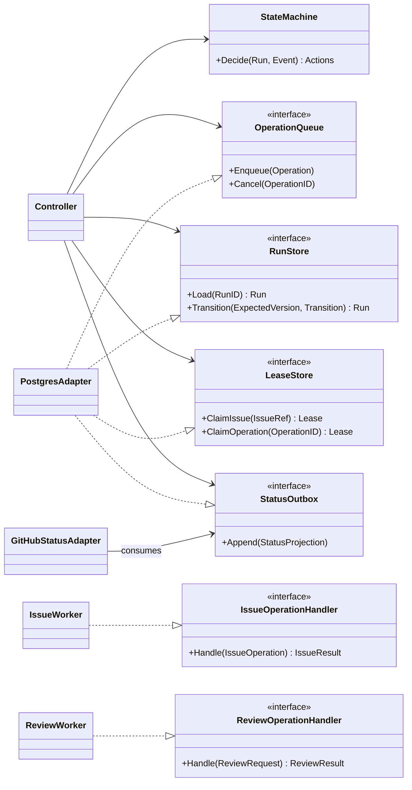
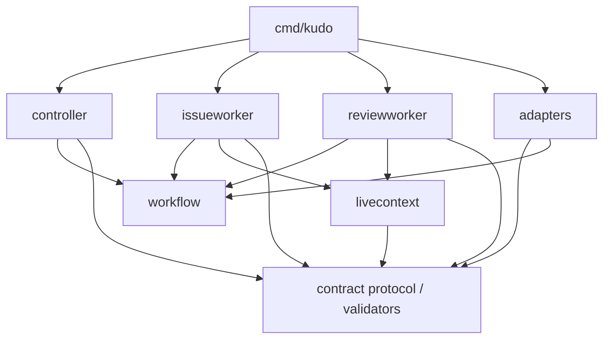

# Architecture

## Architectural style

Kudo は一つの Go module と一つの deployable binary を持つ modular monolith である。同じ binary を起動 mode によって Controller、Issue Worker、Review Worker、migration job として実行し、Docker Compose 上では役割別 container に分離する。

論理 boundary と deployment boundary を区別する。

- Go package と consumer-owned interface が compile-time の責務境界を作る。
- PostgreSQL 上の versioned Operation / Result が runtime の通信境界を作る。
- Compose service が process、filesystem、credential、resource の権限境界を作る。
- Task Issueから再生成したcanonical context、DBに固定したdigest、immutable evidence、commit SHAが
  model session間のcontext境界を作る。

Controller が Codex や Claude を直接操作するのではない。Controller は versioned Execution Policy を Run に固定し、次に許可された [Worker Operation](contracts/operation-protocol-v1alpha1.md) を durable queue へ記録する。該当 Worker が Operation を lease し、policy が指定する provider process を起動する。

## System context



PostgreSQLはworkflow stateと期待input digestの正本、GitHubはlive Issue/repository/PRの正本である。
artifact volumeはGitHubから再取得できないimmutable evidenceのbytesだけを保持する。Task Context系の
canonical YAMLやraw Issue bodyは保存しない。OTelやlog backendは観測用であり、いずれの正本も代替しない。

上図は process / deployment boundary と共通のcompile-time componentを重ねて示す。Issue Compiler +
Context Resolverは通信先serviceではなく、同じGo moduleがIssue Worker / Review Workerの各processへ
compileされることを表す。Issue Contractの意味解析を所有するIssue Compilerは外部I/Oを持たないpure
componentである。component boundaryとclaim時のデータフローは次のとおりである。



GitHub Reader Adapter は API response の transport 表現を typed data へ変換するが、Issue Contract の
section や Acceptance Criteria を解釈しない。Issue Compiler は verified Issue identity と raw body
だけを入力とし、外部 I/O を行わない。Context Resolver は Compiler が返した`ClaimRequirements`に
従い、relationship、dependency、authority、baseをlive sourceから解決する。claim成功時はcanonical bytes
そのものではなくCompiler/schema/digest/baseをstructured checkpointとしてPostgreSQLへ固定する。後続の
Issue WorkerとReview Workerは各Operationでlive Issueを再取得し、同じCompilerで再compileしてcheckpointと
比較する。Controllerはraw Issueを解釈せず、Resultが示すversioned identityとbindingだけを検証する。

## Component responsibilities

### Issue Compiler と Context Resolver

Issue CompilerはIssue Contractを意味解析する唯一のapplication-facing componentである。同じraw body、
verified Issue identity、Compiler versionから、byte単位で同じIssue Observation、canonical Task Context、
Claim Requirementsを生成する。GitHub、repository、filesystem、clock、provider、Artifact Storeへ接続せず、
不正または曖昧な入力を構造化validation errorとして拒否する。生成したcanonical YAMLはdigest計算とその
Operationのmodel入力にだけ使い、Artifact StoreまたはPostgreSQLへbytesとして保存しない。

Context Resolver は Issue Worker の claim handler 内で`ClaimRequirements`を受け取り、native
relationship、dependency completion、authority content、base commit を live source から解決して
Context Manifestとclaim evidenceを構築する。sourceやauthority contentをYAMLの要約へ置換せず、claimでは
そのdigestをRun input checkpointへ固定する。後続Operationは固定baseからrepository contentを、GitHubから
Issue authorityを再取得し、exact bytesのdigestとContext Manifest identityを再計算する。

Issue Compiler は単一 Go module 内の component であり、Compose service や別の`go.mod`には分割しない。
現在の実装上の所有 package は`internal/contract`である。I/O を伴う Context Resolver と live context
reconstructionの共通orchestrationは`internal/livecontext`が所有し、claim固有の候補判定とResult構築は
`internal/issueworker`が所有する。これによりReview WorkerがIssue Workerのconcrete packageに依存せず、
同じ再構築手順を利用できる。

### Controller

Controller は control plane であり、次を所有する。

- GitHub webhook の HTTP ingress と署名検証 adapter の起動
- startup reconciliation と既定15分ごとの fallback polling
- webhook/polling を集約する冪等な`ReconcileIssue`
- Run state machine と許可された transition の検証
- Issue/Run scoped lease と concurrent capacity の調停
- versioned Worker Operation と Review Request の dispatch
- timeout、retry、review round 予算、stale input、escalation の routing
- merge / finalize gate の外形条件（live PR の open / base / head、required status check、mergeable）の read-only 評価
- transactional outbox による GitHub label/comment projection と merge 完了時の Task Issue close

Controller は model/provider session を持たず、Issue Compiler を呼び出して Issue 本文を解釈しない。
Issue の不足情報を補う prompt も作らない。Worker が返した versioned Result、Run input checkpoint、
artifact ref、schema、digest、request binding、staleness は検証するが、Task Context を再構成せず、reviewer の品質 verdict を approve に
変更しない。

Controller が行える GitHub mutation は、durable state を正本にした Issue label/comment の status projection と、merge completion に伴う Task Issue の close に限る。worktree、branch、commit、Pull Request は変更しない。merge / finalize gate の評価のために pull request と required status check を read-only で観測するが、merge を実行できるのは Issue Worker credential だけである。

### Issue Worker

Issue Worker は deterministic な claim handler と model-bearing handler を持つ implementation data plane
であり、実装側の唯一の writer role である。

- claim handler で live Issue を取得し、Issue Compiler と Context Resolver から claim evidence を作る
- model-bearing Operationの開始時と完了時にlive Issue/authorityを再取得し、CompilerとContext Resolverで
  canonical inputを再生成してRun input checkpointのdigestと比較する
- Run 専用 workspace、worktree、branch、checkpoint commit を管理する
- test authoring/revision、RED command、implementation/repair、GREEN/refactor checks を実行する
- model-bearing Operation ごとに fresh Codex/Claude process を supervision する
- artifact manifest と command evidence を content-addressed store へ追加する
- 固定済み head の compare-and-push と draft Pull Request の ensure/update（`publish_head`）を冪等に行う
- final approve 後に required PR body を確定し draft を解除する（`finalize_pull_request`）
- merge gate 成立後に期待 head SHA を明示した compare-and-merge で merge commit を作り、head branch を削除する（`merge_pull_request`）

同じ Run の新しい Operation は同じ専用 worktree を引き継げる。ただし継続に必要な状態は commit と artifact へ固定し、前 provider session の transcript、session ID、private memory に依存しない。

### Review Worker

Review Worker は read-only evaluator である。

- `test_validity`と`final_implementation`の Review Request を処理する
- live Issueを同じIssue Compilerで再compileし、Task Context/Context Manifest identityをRun input
  checkpointと照合する。開始時と完了時の不一致では品質verdictを返さずstaleとして返す
- request が指す live PR の open/draft 状態・head・base を照合し、観測を lineage へ追記する
- head SHAとimmutable source bundle/snapshot artifactからdisposable checkoutを構築する。既にread-only remoteで取得可能な同一commitは再利用してよい
- 一致確認済みのin-memory canonical Task Context、固定baseから取得したauthority/source、immutable
  evidence artifact、明示されたpolicyだけをfresh provider sessionへ渡す
- 条件付き観点の applicability 宣言を含む versioned`approve`、`request_changes`、`needs_human` Result を返し、宣言の完全性を binding 境界で検証する

Review Worker は implementation workspace volume を mount せず、GitHub write credential を持たない。Review Result artifact の新規追加と Operation Result の記録はできるが、受け取った artifact、source、branch、PR は変更できない。

Review Worker の handler は1つの Request を次の pipeline で処理する。1〜5は model session 起動前の決定論的段階であり、失敗はすべて protocol / staleness / execution failure として返す。6以降だけが品質判断を作る（この分離を選んだ理由 → [ADR-0002](../../adr/0002-pr-anchored-review.md)）。

1. **Lease**: role=review の queued Request を lease し、heartbeat を維持する。
2. **Protocol validation**: strict parse。Request identity を構成する ref 群の schema + digest binding 検証。
3. **Live freshness**: Issue 側は Task Context / Context Manifest を live 再構築して照合し、PR 側は live PR の open 状態・head 一致・base 一致・draft 状態を確認して`pull-request-observation` artifact を固定する。head / base 不一致は stale、close / merge は品質 verdict を返さず人間へ escalate し、body 編集や draft/ready 遷移だけの差分は audit lineage へ追記する。
4. **Artifact resolution**: manifest の全 entry を digest / length 照合で取得し、immutable source snapshot から`headSha`検証済み disposable checkout を構築する。
5. **Deterministic prerequisites**: policy の機械検証（binding 整合、approved-test lineage、evidence の head binding、bound 宣言時の測定 evidence の数値照合）。
6. **Session**: fresh provider process へ組み立てた context を渡す。structured output を strict parse し、不正 output は bounded retry 後に execution failure とする。
7. **Result 構築**: verdict / finding 整合（`approve`に blocking なし、`request_changes` / `needs_human`に blocking 必須）と、条件付き観点の applicability 宣言の完全性を検証し、canonical encode して artifact 追記、Operation result を一度だけ記録する。
8. **Failure taxonomy**: timeout / rate limit / network / provider crash は attempt failure として retry 可能に記録する。品質 verdict と failure を同じ field に載せない。

### GitHub adapters

GitHub 固有処理は薄い adapter とし、次を application operation から分離する。

- webhook signature と payload parsing
- Issue/relationship/dependency/repository content read
- candidate search pagination と rate-limit handling
- label/comment projection
- branch、commit、Pull Request API
- GitHub App installation token の発行

Webhook adapter と poller は business rule を持たず、いずれも`ReconcileIssue`を呼ぶ。Issue Worker の
claim は event payload ではなく live API response を使う。GitHub adapter が担うのは JSON 等の transport
解析と API 操作であり、Issue Contract の意味解析は Issue Compiler だけが行う。

### Provider and process adapters

Codex と Claude は共通の Operation contract を実装する交換可能な adapter である。adapter は provider ごとの CLI invocation、structured output parsing、timeout、signal、exit status、stdout/stderr capture を担当する。

deployment は Issue Worker 用と Review Worker 用の provider を明示的に設定する。同じ provider を選んでもよいが、fresh session、read-only review context、credential/workspace分離は緩和しない。Controllerはprovider/model/adapter versionとtimeout/tool policyをExecution Policy snapshotとして固定し、OperationとReview Requestをそのdigestへbindする。Issue本文からproviderを推測しない。

provider を呼ぶたびに新しい process と operation-scoped state directory を作る。前 Operation の resume token、conversation database、transcript を渡さない。認証 material は read-only secret から供給し、成果として保存しない。

### Persistence and artifact adapters

PostgreSQL adapter は Run、Operation、lease、inbox、outbox、review binding、projection を transaction と constraint で保護する。queue は PostgreSQL 内に置き、Redis、NATS、RabbitMQ を追加しない。

Artifact Storeはlogical metadataとbytesを分ける。bytesはSHA-256をkeyにしたwrite-once layoutへ保存し、
同じdigestへの異なるbytesを拒否する。保存対象はtest plan、patch/source snapshot、command evidence、review
resultなどlive sourceから再取得できない成果物に限定する。raw Issue body、Issue Observation、Task Context、
Context Manifestは保存対象にしない。Issue WorkerとReview Workerは新しいevidence artifactを追加できるが、
既存artifactを上書きまたは削除できない。

## Application boundaries

interface は原則として利用側 package に置く。Controller は大きな`Worker` interface ではなく、実際に dispatch する小さな capability と store interface に依存する。



Runtime transport は interface の method call を模倣する必要はない。PostgreSQL queue の payload は [Worker Operation Protocol](contracts/operation-protocol-v1alpha1.md) のversioned envelopeとし、workerはkindごとのschemaをstrictに検証する。unknown versionやfieldを暗黙に解釈しない。

## Durable model

最低限、次の aggregate/record を永続化する。正確な table schema は migration と code で version 管理する。

| Record | Identity / invariant |
| --- | --- |
| Issue candidate | repository + Issue number。発見結果であり execution authority ではない |
| Run | Run ID。1 IssueRef にwriter-capableなRunは最大一つ。paused Runのresumeまたはsupersedeもtransactionで排他する |
| Run transition | Run ID + monotonic version。compare-and-swap で順序を保つ |
| Operation | stable Operation ID、kind、input digest。Run 内で同じ logical action を重複生成しない |
| Attempt | Operation ID + attempt number。lease、heartbeat、timeout、failure を記録する |
| Inbox | GitHub delivery ID または poll trigger identity。重複 event を吸収する |
| Outbox | projection identity。state commit と同じ transaction で作成する |
| Review binding | request digest と result digest。入力変更時に stale と判定する |
| Run input checkpoint | IssueRef、Compiler version、Issue Observation / Task Context / Context Manifestのschemaとdigest、body digest、base SHA。canonical YAML本文は持たない |
| Execution Policy | provider/model/adapter version、tool/timeout policyのdigest。Run途中で暗黙に変更しない |
| Escalation Policy | attempt retry / review round上限のdigest。claim時にRunへpinし、semantic inputには含めない。値の変更は既存Operation / reviewをstaleにせず次のclaimから有効になる |
| Attempt retry counter | Operation ID + 無人区間。追加Attempt作成時だけ増加し、区間counterはescalationでresetするがAttempt lineageと生涯counterは単調増加する |
| Review round counter | Run ID + review gate。gateごとに独立し、quality verdictが確定したroundを数える。`test_validity`側は`test_revision_required`の確定でも消費する。無人区間counterはescalationで0へ戻り、生涯counterは単調増加する |
| Artifact metadata | digest、media type、length、producer、created time。bytes は volume に置く |

Operation は少なくとも`queued`、`leased`、`succeeded`、`retry_wait`、`failed_terminal`を区別する。Run phase と transport failure を同じ enum に押し込まない。

## Queue, lease, and recovery

Controller は transition と次 Operation の enqueue を同じ transaction で確定する。Worker は対象 role の queued Operation を transaction 内で lease し、heartbeat を更新する。正常終了時は Result digest と terminal status を一度だけ記録する。

process crashまたはnetwork partitionでleaseが失効した場合、reaperがOperationを再度eligibleにする。
新しいattemptは以前のprovider processをresumeせず、Run input checkpointを読み、live GitHub/sourceを
再取得・再compileしてfresh sessionを作る。再生成したTask Context/Context Manifest identityがcheckpointと
一致しなければ`stale_input`として停止する。外部mutationの前後にはidempotency identityを保存し、GitHubの
現在値を照合して二重branch/PR/commentを防ぐ。

retry policy は error class ごとに決める。

- timeout、rate limit、一時的な network/provider failure: exponential backoff と jitter で retry
- invalid provider output: bounded retry 後に execution failure として記録し、品質 verdict には変換しない
- immutable envelope / Result / refのprotocol validation error: ResultまたはAttemptFailureとして受理せず、`ProtocolError`を記録してOperation queue stateを`failed_terminal`、Runを`protocol_validation_failed`の`needs_human`へ送る。同じinputをretryせず、retry budgetも消費しない
- contract/authority conflict、安全判断: `needs_human`
- review の blocking finding: `request_changes`として修正 Operation へ routing。ただし当該 gate の round 上限に達した場合は修正 Operation を発行せず、`review_round_limit_exceeded`として`needs_human`
- implement / repair が承認済み test の変更を要すると判断: `test_revision_required`。rollback 済み head と`test-revision-report`を固定し、`test_validity`の round 予算を1消費して`revise_tests`へ routing。上限到達時は修正 Operation を発行せず`review_round_limit_exceeded`として`needs_human`
- changed Context Manifest/Execution Policy/head/artifact/policy/PR ref: stale。新しい identity で再評価し、古い approval は破棄
- changed Issue Observation / PR observation のみ（Task Context と Context Manifest が同じ）: audit lineage へ追記し、identity と approval は維持
- PR の head 不一致（branch への外部 push を含む）またはbase 不一致: blind mutation せず stale
- Kudo の merge intent に紐付かない PR の close/merge: blind mutation せず、品質 verdict に変換せずに Run を`needs_human`phaseへ送るため人間へescalate
- merge gate の required check failure、conflict、branch protection の拒否: 品質 verdict に変換せず`merge_blocked`として`needs_human`。required check の pending は retry budget を消費しない待機とし、Operation の execution deadline 超過で`merge_blocked`

review round 上限は retry budget と別の予算である。retry budget は同じ logical Operation を何回 execution attempt するかを決め、round 上限は quality verdict が`request_changes`のまま何 round 自動修正を続けるかを決める。片方を使い切ってももう片方は消費しない。詳細は [ADR-0003](../../adr/0003-review-round-limit.md) を正とする。

## Scheduling and concurrency

Task Issue を dependency graph の node、`dependsOn`を readiness edge として扱う。parent/sub-issue relationship、Issue 番号、Project phase から暗黙の順序を作らない。

- dependency のない ready candidate は同時に active Run になれる。
- 1 IssueRef に writer-capable な Run は最大一つ。`needs_human`からの resume/supersede も同じ排他制約を通す。
- 1 Run の state-advancing Operation は同時に一つ。
- 1 worktree の writer はその Run を lease した Issue Worker だけ。
- review 中は対象 head を変更しない。
- provider/CPU/GitHub rate limit による capacity 待ちは dependency blocked ではない。
- repository 全体を直列化する global lock を置かない。

Controller replica、Issue Worker replica、Review Worker replica を増やしても、PostgreSQL constraint と scoped lease が同じ invariant を維持する。Compose の単一 host deployment を標準とするが、同時実行数を一つに固定しない。

## Context and session isolation

Task Issueがexecution-context rootである。Issue Compilerは各Operationでlive Task Issueを同じ規則により
canonical Task Contextへ解釈し、claim時に固定したdigestとの一致を検証する。

```text
Task Issue
├─ canonical Task Context            Task自身のContractと各section
├─ parent                           hierarchyとtraceabilityのみ
├─ dependsOn                       readiness gateのみ
└─ authorityRefs                   明示された実装入力
```

parent、dependency、Issue comment、Project field、provider conversationは、Taskがauthorityとして明示しない限り
session contextに入れない。Context ManifestはTask Context identityと解決結果の一覧をcanonical化してdigestを
計算するための一時表現であり、Issue Observation/raw bodyを含めず、Controllerが作る自然言語要約でもない。
期待するContext Manifest refと再計算に必要なbase SHAはRun input checkpointへ保存するが、
Context Manifestの各fieldやcanonical YAML自体は保存しない。

Implementation と Review が共有できるのは次だけである。

- versioned Operation / Review protocol
- IssueRef、Compiler version、期待Task Context / Context Manifest digest
- 各Operationでlive Issueから再生成し、一致確認したin-memory canonical Task Context
- base/head commit SHA
- 対象 Pull Request reference と exact PR observation
- Context Manifest refとimmutable evidence artifact reference
- versioned Review Result と明示された policy

次は共有しない。

- mutable worktree
- provider session、resume token、conversation transcript
- provider application の private state
- Controller の application-private memory
- Issue Worker の write credential
- attempt retry / review round counterと上限、Escalation Policy（Controller の gate 予算であり、Worker / reviewer の判断入力ではない）

## Mutation authority

| Resource | Controller | Issue Worker | Review Worker |
| --- | --- | --- | --- |
| Run/Operation transition | validate/record | resultを返す | resultを返す |
| GitHub Issue body | no | no | no |
| GitHub label/comment | durable projectionのみ | no | no |
| implementation worktree | no | read/write | no mount |
| branch/commit | no | read/write | read-only checkout |
| Pull Request | no | create/update | read-only |
| live Issue由来context | digest/bindingのみ | 再取得・再compile | 再取得・再compile |
| evidence artifact | no overwrite | read | read |
| new evidence/result artifact | metadataをroute | append | append |
| review verdict | no override | no | create |

## Go package layout

top-level の`pkg/`や`package/` directory は作らない。Kudo は外部 module 向け library API を提供しないため、implementation package は`internal/`へ置く。Go では各 directory 自体が package boundary であり、視覚的な分類だけを目的に深く nest しない。

目標 layout は次のとおりである。空 directory を先に作らず、対応する code と test を実装する milestone で追加する。

```text
cmd/
└─ kudo/                     CLI、role command、composition root
internal/
├─ contract/                 Issue Compiler、Issue/Review/Operation schema、canonical encoding / digest
├─ workflow/                 Run aggregate、pure transition、error/result taxonomy
├─ controller/               reconcile、dispatch、retry、projection use caseと利用側interface
├─ livecontext/              Context Resolver、live再取得・再compile、freshness guard
├─ issueworker/              claim、test、implement、workspace/PR use case
├─ reviewworker/             read-only review use case
├─ artifact/                 content-addressed store contract
├─ adapter/
│  ├─ postgres/              Run store、queue、lease、inbox/outbox、migration
│  ├─ github/                webhook、polling、reader、status、PR adapter
│  ├─ gitworkspace/          clone/worktree/commit/command boundary
│  └─ provider/
│     ├─ codex/              Codex headless process adapter
│     └─ claude/             Claude headless process adapter
└─ telemetry/                structured log、metric、trace adapter
```

依存方向は次を守る。



- `cmd/kudo`だけが concrete adapter を組み立てる。
- `controller`は`issueworker`、`reviewworker`、provider の concrete package を import しない。
- `controller`は`contract`のprotocol validatorを使うがIssue Compilerを呼び出さない。Issue WorkerとReview
  Workerだけが`livecontext`を介して同じCompiler / Resolverを使う。
- adapter は application/domain package が定義した小さい interface を実装する。
- interface は mock のために先回りせず、利用側で複数実装または fake が必要になった時点で定義する。
- test fake は原則として利用側の`_test.go`に置き、production package に汎用`memory.go`を増やさない。
- package 内の file は use case 単位で平らに置いてよい。独立 API と明確な import boundary が生じた場合だけ subpackage に分ける。

## Telemetry

Run ID、Operation ID、attempt、IssueRef、state transition、duration、provider、token/cost、artifact digest、verdict、logical Operationごとの無人区間 / 生涯Attempt数、gateごとの無人区間 / 生涯review round数、escalation回数、escalation reason codeをstructured logとtrace/metricに出せるようにする。Attempt / round分布とescalation reasonの内訳はEscalation Policyの既定値を実測から見直すための材料であり、欠けると上限値が勘のまま固定される。secret、Issueの非公開本文、provider transcript、source bytesを既定でtelemetryへ送らない。

Telemetry backendの欠落やsamplingはworkflow correctnessに影響させない。復旧に必要なworkflow stateと
期待digestはPostgreSQL、再取得可能なlive contentはGitHub、再取得できないevidenceはArtifact Storeに残す。
