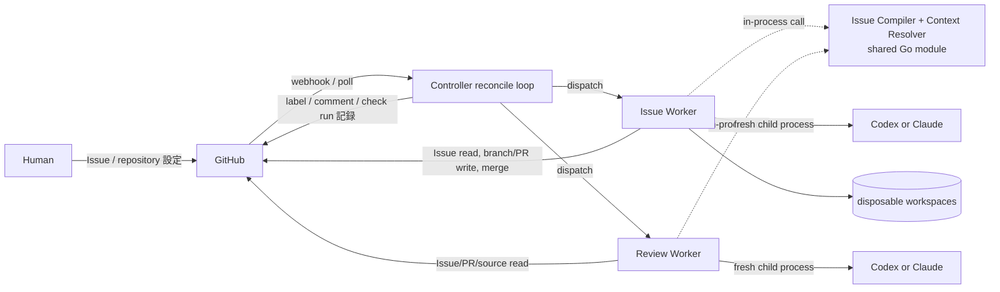
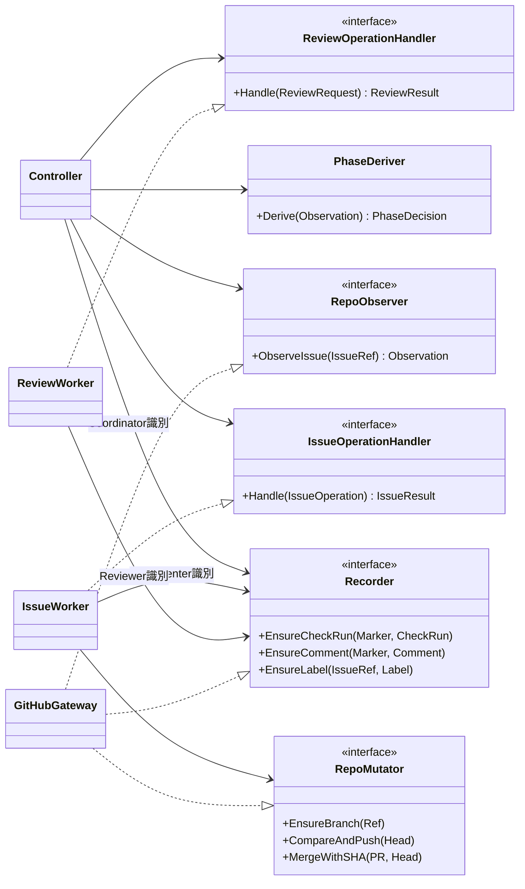
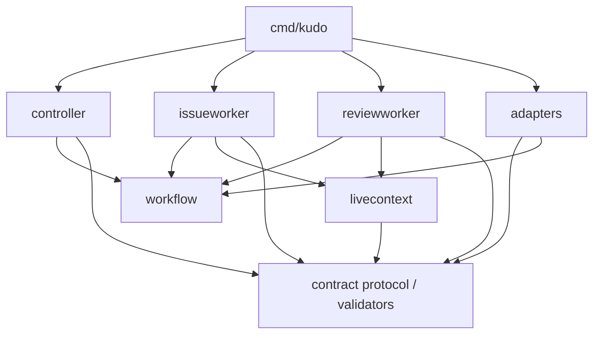

# Architecture

## Architectural style

Kudo は一つの Go module、一つの deployable binary、一つの OS process で動く stateless reconciler である。
GitHub が唯一の正本であり、Kudo は自前の workflow database も artifact store も持たない
（[ADR-0001](../../adr/0001-github-ssot-stateless-reconciler.md)）。process は GitHub を観測して
現在 phase を導出し、次に必要な action を冪等に実行して、結果を GitHub 上の record surface へ書き戻す。

論理 boundary は deployment ではなく次で作る。

- Go package と consumer-owned interface が compile-time の責務境界を作る。
- versioned Operation / Review protocol の envelope が role 間の通信境界を作る。transport が
  in-process call でも、envelope の strict validation は緩和しない。
- role-scoped GitHub credential と process 分離（provider は常に fresh child process）が権限境界を作る。
- Task Issue から再生成した canonical context、claim checkpoint の digest、commit SHA、
  App 所有の check run が model session 間の context 境界を作る。

Controller が Codex や Claude を直接操作するのではない。Controller は versioned Execution Policy を
Run に固定し、導出した phase から次に許可された [Worker Operation](contracts/operation-protocol-v1alpha1.md)
を組み立てて、in-process の該当 Worker へ dispatch する。Worker が policy の指定する provider process を起動する。

## System context



GitHub が live Issue / repository / PR の正本であり、同時に workflow 状態の唯一の永続表現である。
local disk は provider の作業用 workspace と一時 checkout だけに使い、Run をまたいで意味を持つ状態を
置かない。process が消えても、GitHub の観測から同じ phase を再導出できる。OTel や log backend は
観測用であり、正本を代替しない。

Issue Compiler + Context Resolver は通信先 service ではなく、同じ Go module が各 role から呼ばれる
compile-time component である。Issue Contract の意味解析を所有する Issue Compiler は外部 I/O を
持たない pure component である。

## Actor model

Kudo のドメインモデルは、人間が GitHub 上で協働するモデルと同型に設計する。役割は「誰の発話か」で
分かれ、GitHub 上の identity（GitHub App）がそれを表現する。

| Actor | component 名 | 定義 | 発話（GitHub 上の行為） |
| --- | --- | --- | --- |
| Implementer | Issue Worker | 変更の author。PR の作者 | claim（branch を切り PR を開く）、publish（head を差し出す）、attest（自分の実行証跡を記録する）、finalize、merge |
| Reviewer | Review Worker | 判定の author | review（判定する）、report（verdict と finding を自分の名義で投稿する） |
| Coordinator | Controller | 進行の観測者・調停者 | observe、derive（phase 導出）、dispatch、project（label）、escalate（status comment、ledger） |

原則は一つである: **すべての記録は、その発話の主体（author）が自分の identity で書く。** Coordinator は
判定や証跡を代筆しない。代筆を許すと「判定していない者が判定を記録できる」偽造経路になる。

Reviewer の不変条件は「read-only」ではなく「**判定対象への不可侵**」である。source、branch、commit、
PR の状態・本文を変更しないが、自分の判定（verdict check run、finding comment）は自分で記録する。

actor ごとに別の GitHub App identity を使う。最低限 Implementer と Reviewer の分離は必須であり、これに
より「実装が自分を承認する」経路が規約ではなく GitHub の構造（verdict check run は Reviewer App にしか
作れず、branch protection の required check を Reviewer App に pin できる）で塞がる。Coordinator の
identity 分離は timeline の可読性と最小権限のために推奨する。

## State model

### Run の記録面は Pull Request である

claim が成功した時点で Issue Worker は branch と draft Pull Request を作成する。以後この PR が
Run の記録面になり、Run identity は PR 番号である。1 Issue の同時 active Run は最大一つで、
supersede は PR close + branch 削除、再 claim は新しい branch + PR として現れる。過去の Run の
lineage は closed PR の列として GitHub に残る。

### 状態の永続表現

| 事実 | GitHub 上の表現 | 書き手 |
| --- | --- | --- |
| candidate | Issue open + `ai-ready` label + dependency 完了 | 人間（label） |
| claim | branch `kudo/issue-<n>` の存在（ref create は atomic） | Issue Worker |
| Run と claim checkpoint | draft PR + PR body の machine block（Compiler version、Task Context / Context Manifest / Execution / Escalation Policy digest、base SHA） | Issue Worker |
| RED / GREEN / checks evidence | 対象 head への evidence check run（command、exit status、出力抜粋） | Issue Worker |
| review verdict | 対象 head への verdict check run（verdict と request identity を output に記録） | Review Worker |
| finding 本文 | PR comment（machine marker 付き） | Review Worker |
| review round 数 | Reviewer 名義の marker 付き finding comment の計数（独立した counter を持たない） | 導出 |
| merge intent | merge 直前の intent comment | Issue Worker |
| terminal | PR merged / closed、Issue close、`ai-merged` label | Issue Worker / Controller |
| escalation | `ai-needs-human` label + status comment | Controller |

check run は作成した GitHub App 以外に書き換えられず、commit SHA へ構造的に束縛される。改竄耐性と
head binding が必要な事実（evidence、verdict）は check run に置き、人間が読み修正 loop の入力になる
散文（finding）は comment に置く。check run の検証は name だけでなく作成 App の identity でも行う。
Implementer App が`kudo/test-validity`という name の check run を作っても、Reviewer App 名義でない
verdict は gate の入力にしない。comment と PR body の machine block は repository write 権限者が
編集できるため、gate の真偽判定には使わず、verdict check run の output に記録した digest との照合で
改竄を検出する。

### 導出と phase

Controller は webhook / poll を契機に対象 Issue / PR / branch / check run / comment を観測し、
純関数で現在 phase を導出する。phase を database に保存せず、導出結果同士を同期しない。観測の
組み合わせが中間状態（branch はあるが PR がない、evidence はあるが verdict がない等）を示す場合も、
導出関数は必ず「次に必要な action」か「escalation」のどちらかへ写像する。phase の全域な導出表は
[workflow.md](02_workflow.md) を正とする。

### 冪等性と fencing

すべての action は at-least-once で実行され、重複は次で吸収する。

- **CAS**: branch ref create（claim の排他）、compare-and-push（外部 push の検出）、SHA 指定
  merge（merge fencing）。期待値不一致は stale として再導出へ戻す。
- **marker**: comment / check run に機械可読な marker（kind、round、head、request digest）を含め、
  書き込み前に既存 marker を検索して重複を防ぐ。
- **観測による収束**: label 付与、Issue close、branch 削除は現在値を確認してから行う冪等 mutation
  とする。

## Component responsibilities

### Issue Compiler と Context Resolver

Issue Compiler は Issue Contract を意味解析する唯一の application-facing component である。同じ raw
body、verified Issue identity、Compiler version から、byte 単位で同じ Issue Observation、canonical
Task Context、Claim Requirements を生成する。GitHub、repository、filesystem、clock、provider へ接続
せず、不正または曖昧な入力を構造化 validation error として拒否する。生成した canonical YAML は
digest 計算とその Operation の model 入力にだけ使い、bytes をどこにも保存しない。

Context Resolver は Issue Worker の claim handler 内で`ClaimRequirements`を受け取り、native
relationship、dependency completion、authority content、base commit を live source から解決して
Context Manifest と claim evidence を構築する。claim では canonical bytes そのものではなく
Compiler / schema / digest / base を claim checkpoint として PR body の machine block へ固定する。
後続の Issue Worker と Review Worker は各 Operation で live Issue を再取得し、同じ Compiler で
再 compile して checkpoint と比較する。Controller は raw Issue を解釈せず、Result が示す versioned
identity と binding だけを検証する。

実装上の所有 package は`internal/contract`（Compiler）、`internal/livecontext`（Resolver と live
再構築の共通 orchestration）、`internal/issueworker`（claim 固有の候補判定と Result 構築）である。
Review Worker は Issue Worker の concrete package に依存せず、同じ再構築手順を利用する。

### Controller

Controller は reconcile loop であり、次を所有する。

- GitHub webhook の HTTP ingress と署名検証 adapter の起動
- startup reconciliation と既定15分ごとの fallback polling
- webhook / polling を集約する冪等な`ReconcileIssue`（観測 → phase 導出 → 次 action）
- 導出 phase と許可された transition の検証
- 同時実行 capacity の調停（in-process semaphore）
- versioned Worker Operation と Review Request の組み立てと in-process dispatch
- timeout、retry、review round 予算、stale input、escalation の routing
- merge / finalize gate の外形条件（live PR の open / base / head、required status check、mergeable）の read-only 評価
- Worker が記録した evidence / verdict の存在・binding・作成 identity の検証
- status comment、label、escalation（round ledger を含む）の記録（marker で冪等化）

Controller は model / provider session を持たず、Issue Compiler を呼び出して Issue 本文を解釈しない。
Issue の不足情報を補う prompt も作らない。Worker が返した versioned Result の schema、digest、
request binding、staleness は検証するが、Task Context を再構成せず、reviewer の品質 verdict を
approve に変更しない。

Controller が行える GitHub mutation は、label と Coordinator 名義の comment（status、escalation）に
限る。evidence にも verdict にも触れず、worktree、branch、commit、Pull Request の内容も変更しない。
merge を実行できるのは Issue Worker credential だけである。

### Issue Worker

Issue Worker は deterministic な claim handler と model-bearing handler を持つ implementation data
plane であり、実装側の唯一の writer role である。

- claim handler で live Issue を取得し、Issue Compiler と Context Resolver から claim evidence を作る
- branch `kudo/issue-<n>`を ref create で排他的に作成し、draft PR を claim checkpoint 付きで ensure する
- model-bearing Operation の開始時と完了時に live Issue / authority を再取得し、Compiler と Context
  Resolver で canonical input を再生成して claim checkpoint の digest と比較する
- Run 専用 workspace、worktree、checkpoint commit を管理する
- test authoring/revision、RED command、implementation/repair、GREEN/refactor checks を実行する
- model-bearing Operation ごとに fresh Codex/Claude process を supervision する
- 固定済み head の compare-and-push を冪等に行う（`publish_head`）
- RED / GREEN / checks の evidence check run と test plan / PR draft の marker comment を自分の名義で記録する（attest）
- final approve 後に required PR body を確定し draft を解除する（`finalize_pull_request`）
- merge gate 成立後に期待 head SHA を明示した merge で merge commit を作り、head branch を削除する（`merge_pull_request`）

同じ Run の新しい Operation は同じ専用 worktree を引き継げる。ただし継続に必要な状態は commit へ
固定し、前 provider session の transcript、session ID、private memory に依存しない。workspace は
disposable であり、失われたら base と published head から再構築する。

### Review Worker

Review Worker は read-only evaluator である。

- `test_validity`と`final_implementation`の Review Request を処理する
- live Issue を同じ Issue Compiler で再 compile し、Task Context / Context Manifest identity を
  claim checkpoint と照合する。開始時と完了時の不一致では品質 verdict を返さず stale として返す
- request が指す live PR の open / draft 状態・head・base を照合する
- `headSha`を検証した disposable checkout を read-only clone から構築する
- 一致確認済みの in-memory canonical Task Context、固定 base から取得した authority / source、
  head に束縛された evidence check run、明示された policy だけを fresh provider session へ渡す
- 条件付き観点の applicability 宣言を含む versioned`approve`、`request_changes`、`needs_human`
  Result を構築し、宣言の完全性を binding 境界で検証する
- verdict check run と finding comment を**自分の App 名義で**対象 head へ記録し（report）、Result を
  in-process で Controller へ返す

Review Worker は implementation workspace を参照せず、**判定対象への write**（contents、branch、PR の
状態・本文）を持たない。書けるのは自分の verdict check run と finding comment だけである。受け取った
source、branch、PR は変更できない。Controller は記録の binding を検証するが、verdict を代筆も上書きも
しない。

Review Worker の handler は1つの Request を次の pipeline で処理する。1〜4は model session 起動前の
決定論的段階であり、失敗はすべて protocol / staleness / execution failure として返す。5以降だけが
品質判断を作る。

1. **Protocol validation**: strict parse。Request identity を構成する ref 群の schema + digest binding 検証。
2. **Live freshness**: Issue 側は Task Context / Context Manifest を live 再構築して照合し、PR 側は
   live PR の open 状態・head 一致・base 一致・draft 状態を確認する。head / base 不一致は stale、
   close / merge は品質 verdict を返さず人間へ escalate する。
3. **Checkout**: read-only clone から`headSha`検証済み disposable checkout を構築する。
4. **Deterministic prerequisites**: policy の機械検証（evidence check run の head binding、
   approved-test lineage、bound 宣言時の測定 evidence の数値照合）。
5. **Session**: fresh provider process へ組み立てた context を渡す。structured output を strict parse
   し、不正 output は bounded retry 後に execution failure とする。
6. **Result 構築と report**: verdict / finding 整合（`approve`に blocking なし、`request_changes` /
   `needs_human`に blocking 必須）と、条件付き観点の applicability 宣言の完全性を検証し、verdict
   check run と finding comment を自分の名義で記録してから返す。
7. **Failure taxonomy**: timeout / rate limit / network / provider crash は attempt failure として
   retry 可能に返す。品質 verdict と failure を同じ field に載せない。

### GitHub gateway

GitHub アクセスは単一実装の gateway（`internal/adapter/github`）へ集約する。record surface の形式
（marker、machine block、check run output）は事実上の protocol 層であり、encode / parse が複数実装に
散ると「書いた側と読んだ側の解釈のずれ」が workflow を壊すためである。gateway は次を所有する。

- webhook signature と payload parsing
- Issue / relationship / dependency / repository content read と、観測 snapshot の組み立て
- candidate search pagination、rate-limit handling、transport failure 分類の一点集約
- label / comment / check run の記録と marker 検索（冪等化）
- record surface 形式（marker、machine block の包み紙、check run output、comment / PR body template）
  の render / parse。golden fixture で固定する
- branch、commit、Pull Request、merge API（CAS 前提条件付き）
- GitHub App installation token の発行

**実装は 1 つ、instance は actor ごと**である。gateway を package-level singleton にせず、actor の
App credential を constructor で注入した capability 別 instance（Observer は全 actor、Recorder は
記録を持つ actor、RepoMutator は Issue Worker のみ）として使う。gateway 自体は権限を持たない。

パースは 3 層に分かれたまま保つ。gateway は transport と record surface の形式だけを解釈し、machine
block の中身の canonical encode / decode と digest は`internal/contract`、Issue Contract の意味解析は
Issue Compiler だけが行う。gateway は raw Issue body を検証済み identity 付きの不透明な値として渡し、
Contract の section を解釈しない。

Webhook adapter と poller は business rule を持たず、いずれも`ReconcileIssue`を呼ぶ。phase 導出と
gate 判定を gateway に持ち込まない。Issue Worker の claim は event payload ではなく live API response
を使う。

### Provider and process adapters

Codex と Claude は共通の Operation contract を実装する交換可能な adapter である。adapter は provider
ごとの CLI invocation、structured output parsing、timeout、signal、exit status、stdout/stderr capture
を担当する。

deployment は Issue Worker 用と Review Worker 用の provider を明示的に設定する。同じ provider を
選んでもよいが、fresh session、read-only review context、credential 分離は緩和しない。Controller は
provider / model / adapter version と timeout / tool policy を Execution Policy snapshot として固定し、
Operation と Review Request をその digest へ bind する。Issue 本文から provider を推測しない。

provider を呼ぶたびに新しい process と operation-scoped state directory を作る。前 Operation の
resume token、conversation database、transcript を渡さない。認証 material は read-only secret から
供給し、成果として保存しない。

## Application boundaries

interface は原則として利用側 package に置く。Controller は大きな`Worker` interface ではなく、実際に
dispatch する小さな capability と observation interface に依存する。



各 actor が使う`Recorder`は同じ gateway 実装だが、注入された App credential が違う別 instance で
ある。書ける対象は capability と identity の両方で制限される。

PhaseDeriver は observation を入力とする pure component であり、I/O を持たない。dispatch の transport
は in-process call だが、payload は [Worker Operation Protocol](contracts/operation-protocol-v1alpha1.md)
の versioned envelope とし、worker は kind ごとの schema を strict に検証する。unknown version や
field を暗黙に解釈しない。

## Recovery and failure taxonomy

process crash からの復旧は「再起動して再観測する」だけである。lease、reaper、queue の復旧手順は
存在しない。実行途中だった Operation は provider child process ごと消え、再導出された phase が同じ
action を要求すれば新しい fresh attempt として実行される。外部 mutation は marker と CAS が重複を防ぐ。

retry policy は error class ごとに決める。

- timeout、rate limit、一時的な network / provider failure: exponential backoff と jitter で retry
- invalid provider output: bounded retry 後に execution failure として記録し、品質 verdict には変換しない
- immutable envelope / Result / ref の protocol validation error: 受理せず`ProtocolError`を記録して
  `protocol_validation_failed`の`needs_human`へ送る。同じ input を retry せず、retry budget も消費しない
- contract / authority conflict、安全判断: `needs_human`
- review の blocking finding: `request_changes`として修正 Operation へ routing。ただし当該 gate の
  round 上限に達した場合は修正 Operation を発行せず、`review_round_limit_exceeded`として`needs_human`
- implement / repair が承認済み test の変更を要すると判断: `test_revision_required`。rollback 済み
  head と`test-revision-report`を固定し、`test_validity`の round 予算を1消費して`revise_tests`へ
  routing。上限到達時は`review_round_limit_exceeded`として`needs_human`
- changed Context Manifest / Execution Policy / head / policy / PR ref: stale。新しい identity で
  再評価し、古い approval は破棄
- changed Issue Observation のみ（Task Context と Context Manifest が同じ）: identity と approval を維持
- PR の head 不一致（branch への外部 push を含む）または base 不一致: blind mutation せず stale
- Kudo の merge intent comment に紐付かない PR の close / merge: blind mutation せず、品質 verdict に
  変換せずに`needs_human`へ escalate
- merge gate の required check failure、conflict、branch protection の拒否: 品質 verdict に変換せず
  `merge_blocked`として`needs_human`。required check の pending は retry budget を消費しない待機とする

review round 上限は retry budget と別の予算である。retry budget は同じ logical Operation を何回
execution attempt するかを決め、round 上限は quality verdict が`request_changes`のまま何 round 自動
修正を続けるかを決める。round は marker 付き finding comment から導出する durable な予算であり、
execution attempt counter は process-local である。process の再起動で attempt counter は失われるが、
round 予算と escalation が無人 loop の外側の防波堤になる。counter の詳細は
[github-routing.md](04_github-routing.md) を正とする。

## Scheduling and concurrency

Task Issue を dependency graph の node、`dependsOn`を readiness edge として扱う。parent / sub-issue
relationship、Issue 番号、Project phase から暗黙の順序を作らない。

- dependency のない ready candidate は同時に active Run になれる。
- 1 IssueRef に active な Run（open な kudo PR）は最大一つ。排他は branch ref create の atomicity で行う。
- 1 Run の state-advancing Operation は同時に一つ（in-process 排他）。
- 1 worktree の writer はその Run を実行する Issue Worker だけ。
- review 中は対象 head を変更しない。
- provider / CPU / GitHub rate limit による capacity 待ちは dependency blocked ではない。
- repository 全体を直列化する global lock を置かない。

同一 repository への Kudo instance は一つとする（[ADR-0001](../../adr/0001-github-ssot-stateless-reconciler.md)
の前提）。branch CAS と compare-and-push は誤って二重起動した場合の破壊を防ぐが、二重実行の効率は保証しない。

## Context and session isolation

Task Issue が execution-context root である。Issue Compiler は各 Operation で live Task Issue を同じ
規則により canonical Task Context へ解釈し、claim 時に固定した digest との一致を検証する。

```text
Task Issue
├─ canonical Task Context            Task自身のContractと各section
├─ parent                           hierarchyとtraceabilityのみ
├─ dependsOn                       readiness gateのみ
└─ authorityRefs                   明示された実装入力
```

parent、dependency、Issue comment、Project field、provider conversation は、Task が authority として
明示しない限り session context に入れない。Context Manifest は Task Context identity と解決結果の
一覧を canonical 化して digest を計算するための一時表現であり、Issue Observation / raw body を含めず、
Controller が作る自然言語要約でもない。期待する Context Manifest ref と再計算に必要な base SHA は
claim checkpoint（PR body の machine block）へ記録するが、Context Manifest の各 field や canonical
YAML 自体は保存しない。

Implementation と Review が共有できるのは次だけである。

- versioned Operation / Review protocol
- IssueRef、Compiler version、期待 Task Context / Context Manifest digest
- 各 Operation で live Issue から再生成し、一致確認した in-memory canonical Task Context
- base / head commit SHA
- 対象 Pull Request reference
- head に束縛された evidence / verdict check run と finding comment
- versioned Review Result と明示された policy

次は共有しない。

- mutable worktree
- provider session、resume token、conversation transcript
- provider application の private state
- Controller の process-local state
- Issue Worker の write credential
- attempt retry / review round counter と上限、Escalation Policy（Controller の gate 予算であり、
  Worker / reviewer の判断入力ではない）

## Mutation authority

| Resource | Controller (Coordinator) | Issue Worker (Implementer) | Review Worker (Reviewer) |
| --- | --- | --- | --- |
| GitHub Issue body | no | no | no |
| label / status comment | 記録（marker 冪等） | no | no |
| evidence check run、test plan / PR draft comment | no | 自名義で記録 | no |
| verdict check run、finding comment | no | no | 自名義で記録 |
| implementation worktree | no | read/write | no |
| branch / commit | no | read/write（CAS） | read-only checkout |
| Pull Request | no | create/update/merge | read-only |
| live Issue 由来 context | digest/binding のみ | 再取得・再 compile | 再取得・再 compile |
| review verdict | binding 検証のみ、no override / no 代筆 | no | create + 自名義で記録 |

## Go package layout

top-level の`pkg/`や`package/` directory は作らない。Kudo は外部 module 向け library API を提供
しないため、implementation package は`internal/`へ置く。Go では各 directory 自体が package boundary
であり、視覚的な分類だけを目的に深く nest しない。

目標 layout は次のとおりである。空 directory を先に作らず、対応する code と test を実装する milestone
で追加する。

```text
cmd/
└─ kudo/                     CLI、composition root
internal/
├─ contract/                 Issue Compiler、Issue/Review/Operation schema、canonical encoding / digest
├─ workflow/                 phase 導出（pure）、許可 transition、error/result taxonomy
├─ controller/               reconcile、dispatch、retry、record use caseと利用側interface
├─ livecontext/              Context Resolver、live再取得・再compile、freshness guard
├─ issueworker/              claim、test、implement、workspace/PR use case
├─ reviewworker/             read-only review use case
├─ adapter/
│  ├─ github/                webhook署名検証・payload形式解釈、polling、reader、check run/comment/label recorder、PR adapter
│  ├─ httpingress/           HTTP ingress（webhook route、`healthz` / `readyz`、server timeout policy）
│  ├─ gitworkspace/          clone/worktree/commit/command boundary
│  └─ provider/
│     ├─ codex/              Codex headless process adapter
│     └─ claude/             Claude headless process adapter
└─ telemetry/                structured log、metric、trace adapter
```

HTTP ingress を`adapter/github`から分けるのは、`healthz` / `readyz`が GitHub 固有ではなく
process と設定の状態を返す endpoint だからである。webhook の署名検証と payload 形式解釈は
gateway の所有のまま`adapter/github`に残し、`adapter/httpingress`は route、HTTP status、
server の timeout policy だけを持つ。

依存方向は次を守る。



- `cmd/kudo`だけが concrete adapter を組み立てる。
- `controller`は`issueworker`、`reviewworker`、provider の concrete package を import しない。
- `controller`は`contract`の protocol validator を使うが Issue Compiler を呼び出さない。Issue Worker
  と Review Worker だけが`livecontext`を介して同じ Compiler / Resolver を使う。
- adapter は application/domain package が定義した小さい interface を実装する。
- interface は mock のために先回りせず、利用側で複数実装または fake が必要になった時点で定義する。
- test fake は原則として利用側の`_test.go`に置き、production package に汎用`memory.go`を増やさない。
- package 内の file は use case 単位で平らに置いてよい。独立 API と明確な import boundary が生じた
  場合だけ subpackage に分ける。

## Telemetry

Run（PR 番号）、Operation、attempt、IssueRef、phase 導出結果、duration、provider、token/cost、
verdict、logical Operation ごとの attempt 数、gate ごとの無人区間 / 生涯 review round 数、escalation
回数、escalation reason code を structured log と trace/metric に出せるようにする。attempt / round
分布と escalation reason の内訳は Escalation Policy の既定値を実測から見直すための材料であり、
欠けると上限値が勘のまま固定される。secret、Issue の非公開本文、provider transcript、source bytes を
既定で telemetry へ送らない。

Telemetry backend の欠落や sampling は workflow correctness に影響させない。workflow 状態は GitHub の
観測から導出し、evidence と verdict は check run に、finding は comment に残る。telemetry はいずれの
正本も代替しない。
