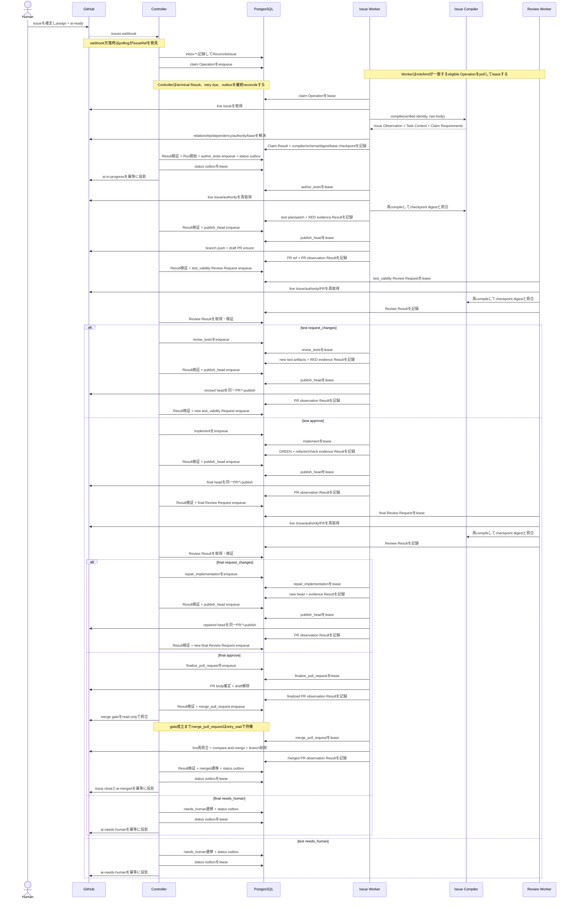
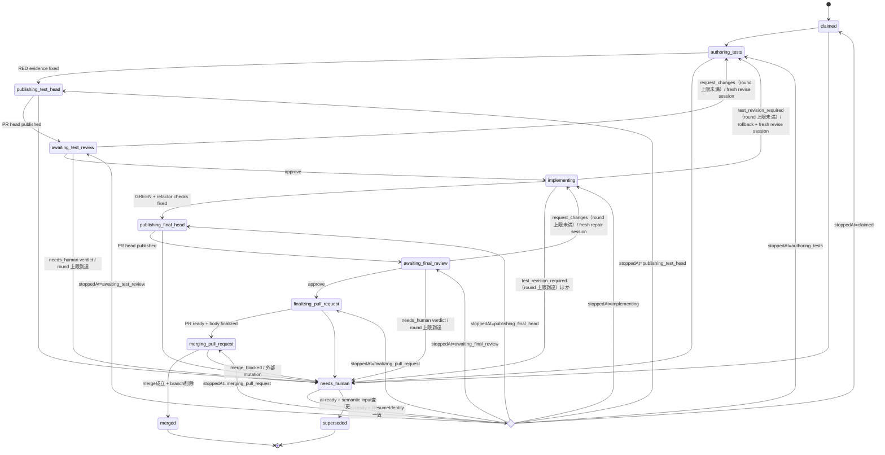

# End-to-end workflow

## Purpose

本書は、人間が Task Issue を準備してから、Kudo が Pull Request を作成し、承認済み head を merge して Issue を close するまでの規範的な順序を定義する。外部 protocol の field は [Issue Contract](contracts/issue-contract-v1alpha1.md) と [Implementation–Review Protocol](contracts/review-protocol-v1alpha1.md)を正とする。

## Actors

- Human Author: Issue Contract を完成させ、`mrbaron3`を assign し、`ai-ready`で実行を依頼する。
- Controller: 候補を reconcile し、状態遷移を検証し、Operation を dispatch し、GitHub status を投影する。model session は持たない。
- Issue Worker: implementation側の唯一のwriter。各Operationでlive Issueをcompileし、専用worktree、branch、test、source、commit、Pull Requestを変更できる。
- Review Worker: 各Review Operationでlive Issueをcompileし、read-only checkoutとimmutable evidenceからtest validityと最終実装を判定する。implementationのsource、branch、PRは変更できない。
- GitHub: live Issue、repository、Pull Request の source of truth。
- PostgreSQL: Run、Operation、lease、inbox/outbox、projection intent の authoritative workflow store。

## Preconditions

人間は `.github/ISSUE_TEMPLATE/kudo-task.md` を使い、次を満たす。

1. required section と Contract block をすべて確定する。
2. `kind: task`、`readiness: ready`にする。
3. Acceptance Criteria を観測可能な Given/When/Then で書き、ID を Contract block と一致させる。
4. 参照すべき仕様を`authorityRefs`へ優先順位の高い順に列挙する。
5. `mrbaron3`を assign する。
6. 最後に`ai-ready`を付ける。

`ai-ready`は契約内容ではなく、完成した契約に対する one-shot execution request である。

## Normal flow

Controller と Worker の間に direct RPC はない。Controller が「Operationを発行する」とは、Run transition
と versioned Operation / Review Request の enqueue を同じ PostgreSQL transaction で確定することをいう。
Worker は対象 role / kind の eligible row を poll して lease し、Result または Attempt Failure も
PostgreSQL へ記録する。Controller は terminal Result、retry due、outbox を継続的に reconcile し、Result
の binding を検証して次の transition を決める。図中の「Result検証 + transition」は、この読み取りと
transactional commit をまとめた表記である。DB の wake-up 最適化を追加する場合も、通知自体を正本にせず
durable row の polling を fallback として維持する。

### 1. Discovery and reconciliation

Webhook adapter は署名を検証し、delivery ID と IssueRef を durable inbox に記録する。定期 poller は起動時と既定15分ごとに、configured repository の open Issue を検索する。どちらも同じ`ReconcileIssue(IssueRef, Trigger)`を起動し、payload 内の Issue body を実装入力にしない。

Reconciliation は live GitHub state で candidate 条件を確認する。条件を満たさない Issue は`skipped_not_candidate`として終了し、失敗や escalation にしない。

### 2. Claim

Controller は IssueRef に対する短い claim lease を取得し、claim Operation を PostgreSQL queue へ
enqueue する。Issue Worker は対象 Operation を lease してから deterministic claim handler を開始する。
claim handler は GitHub から現在の Issue を直接取得し、verified Issue identity と raw body を pure な
Issue Compiler へ渡す。Issue Compiler だけが Contract、section、
Acceptance Criteria を strict parse し、Issue Observation、canonical Task Context、Claim Requirements を
返す。claim handler の Context Resolver は Claim Requirements に従って native relationship、dependency、
authority、base commitをlive sourceから解決し、Context Manifest identityを計算する。

Claim ResultはCompiler version、Issue Observation ref/body digest、Task Context ref、Context Manifest ref、
base SHAからなるstructured claim contextを返す。raw Issue body、Issue Observation YAML、Task Context YAML、
Context Manifest YAMLはArtifact StoreにもPostgreSQLにも保存しない。Controllerはschema、digest、bindingを
検証するが、raw Issue bodyまたはTask Contextのproseを再解釈しない。

claim成功時は、Run、structured claim context、Execution Policy、Escalation Policyを一つのdurable transition
として確定する。その後、outboxから`ai-ready`と古いstatus labelを外し、`ai-in-progress`を付ける。
GitHub projectionが一時的に失敗してもRunを巻き戻さない。
workflowの`ClaimSucceeded` eventもstructured claim context全体を運び、Context Manifest refだけへ縮約しない。
最新のIssue Observation audit lineageはschema付きrefとbody digestを組で保持する。

### Live context reconstruction

claim後にTask Contextを必要とするIssue Worker / Review Worker Operationは、開始時に次を行う。

1. PostgreSQLからRunのstructured claim contextを読む。
2. GitHubからlive Task Issueを取得し、claim時と同じCompiler versionでstrict parseする。
3. pin済みbase SHAからrepository authorityを、GitHubからIssue authorityを取得し、Context Manifestを再計算する。
4. Task Context refとContext Manifest refをclaim contextの期待値と比較する。
5. 一致したcanonical Task Contextとauthority contentだけをin-memoryのmodel inputとして使う。

Operation完了時にも同じ比較を行う。開始時または完了時にidentityが一致しなければResultやreview verdictを
確定せず`stale_input`としてControllerへ返す。raw bodyだけの非意味的差分でTask Context/Context Manifestが
一致する場合はbody digestのaudit lineageをPostgreSQLへ追記して継続する。canonical bytesはAttempt終了時に
破棄し、次Operationへartifactとして渡さない。

model sessionを持たない`finalize_pull_request`と`merge_pull_request`も、開始時に同じ再構築と照合を行う。
final approve後にIssueが意味的に編集される窓を検出できる最後のenforcement pointであり、mergeは取り消せ
ないmutationだからである。完了時の照合は要求しない。`publish_head`は対象外で、publish後のstalenessは
次のReview Requestの開始時照合が検出する。

### 3. Test authoring and RED

Issue Workerはfresh provider sessionで`author_tests`を実行する。sessionには直前にlive sourceから再生成して
期待digestと一致したcanonical Task Context、authority content、base/head SHA、明示されたpolicyだけを渡す。
raw Issue bodyはcompile入力であり、canonical Task Contextと重ねてmodel inputへ渡さない。

test plan は各 Acceptance Criteria と test case の対応を示す。テストを追加した head で規定 command を実行し、対象機能の欠如に起因する期待どおりの failure を RED evidence として固定する。環境故障、compile infrastructure failure、無関係な既存 failure を RED とみなさない。

Issue Worker は test-only checkpoint commit、patch、command、exit status、stdout/stderr、environment identity を artifact manifest に記録する。RED が成立しなければ review へ進めない。

RED 固定後、Controller は`publish_head`を発行する。Issue Worker は期待 head と live branch head を照合してから push し（compare-and-push）、draft Pull Request を冪等に ensure する。PR body は artifact から決定論的に生成し、Task Issue link、Run ID、phase、test plan 要約を含む。published head、PR reference、pull request observation が durable に記録された後にだけ review round を開始する。draft PR 上の CI が RED になるのは TDD の位相の正直な表示であり、隠すために publish を遅らせない。全 review round は以後この同一 draft PR へ繋留される（[ADR-0002](../../adr/0002-pr-anchored-review.md)）。

### 4. Test validity review

Controllerは期待digest、evidence、publish済みdraft PRのheadへ繋留された`test_validity` Review Requestを作り、[Test Validity Review Policy](review-policies/test-validity-v1alpha1.md)を`policyRefs`へ含める。required policy refが欠落または未対応のRequestはbinding境界でrejectされ、reviewerの推測で補わない。policy取得のtransport failureもquality verdictへ変換しない。Review Workerはlive Issueを再compileしてTask Context/Context Manifest identityを照合し、live PRのopen/draft状態・head/baseも照合する。context、head、baseの不一致は品質verdictではなくstale、Kudo自身のmerge intentに紐付かないclose/mergeは品質verdictに変換せず、Runを`needs_human`phaseへ送るため人間へescalateする。PR body編集またはdraft/ready遷移だけの差分はaudit lineageへ追記する。そのうえでfresh sessionと別のread-only checkoutを使い、再生成したcanonical Task Context、Acceptance Criteria、test plan、test patch、RED evidenceをpolicyの標準観点で評価する。

- `approve`: 承認対象 digest を固定し、implementation へ進む。
- `request_changes`: blocking finding を versioned Result として返す。Controller は同じ Run/worktree を所有する Issue Worker の新しい`revise_tests` session へ finding と artifact を渡す。
- `needs_human`: 自動修正できない authority または安全判断として workflow を停止する。

`request_changes`が Run に固定された`test_validity`の round 上限に達した場合、Controller は`revise_tests`を発行せず`needs_human`phase へ送る。verdict は`request_changes`のままであり、上限判定は Controller だけが行う。

「元の作業へ差し戻す」とは同じ論理 lane と worktree を使うことであり、以前の provider conversation を resume することではない。修正後は新しい head を同一 draft PR へ再 publish し、新しい artifact manifest、Review Request を作り、再 review する。

### 5. GREEN and refactor

test validity approval後にだけ、Issue Workerはfresh`implement` sessionを開始する。入力はlive sourceから
再生成して期待digestと一致したcanonical Task Context/authority、approved test/result、現在headであり、
raw Issue body、test authorまたはreviewerのtranscriptではない。

implementation は次を順に満たす。

1. 承認済み test を変更せずに production code を実装する。
2. 対象 test と必要な回帰 test を通し、GREEN evidence を固定する。
3. behavior を保ったまま重複、命名、構造を refactor する。
4. Issue の Verification と repository の required checks を再実行する。
5. test 変更が必要になった場合は implementation 中に書き換えず、test authoring/review gate へ戻す。

`implement`または`repair_implementation`が承認済みtestの変更を必要とする場合、そのResultをGREEN完了として受理しない。Issue Workerは未承認のtest/production変更を最後に承認されたtest checkpointへrollbackし、rollback済みheadと根拠の`test-revision-report`を持つ`test_revision_required` Resultを返す（[Worker Operation Protocol](contracts/operation-protocol-v1alpha1.md)）。この差し戻しはquality verdictでもexecution failureでもなく、`test_validity` gateの無人round予算を1消費する。予算が残る場合、Controllerはreportとrollback済みheadを入力に`revise_tests`をfresh sessionでdispatchする。上限に達した場合は修正Operationを発行せず、`review_round_limit_exceeded`として`needs_human`へ送る。変更後のtest head、RED evidence、Artifact Manifestを同一draft PRへpublishし、新しい`test_validity` approvalを得るまでimplementationへ戻らない。これにより、implementation laneがtest review gateを迂回して承認済みtestを書き換える経路を閉じる。

GREEN と refactor の evidence が固定された後、Controller は`publish_head`で final head を同一 draft PR へ publish し、その後にだけ final review を開始する。

### 6. Final implementation review

final head の publish 後に、Controller は final head、approved test review、implementation patch、GREEN/refactor/check evidence を固定し、publish 済み PR へ繋留され[Final Implementation Review Policy](review-policies/final-implementation-v1alpha1.md)を`policyRefs`へ含む`final_implementation` Review Request を発行する。required policy refが欠落または未対応のRequestはbinding境界でrejectされ、reviewerの推測で補わない。policy取得のtransport failureもquality verdictへ変換しない。Review Worker は fresh read-only session で常時必須のcorrectness、regression、scope、test quality、code quality、security、evidenceを評価する。条件付き観点（UX、accessibility、type design、performance）の適用可否は同じ session がpolicyの適用条件から判断し、観点別の applicability 宣言（理由 code と evidence 付き）として Result へ残す。宣言を欠く Result は binding 境界で受理されない。

`request_changes`は fresh`repair_implementation` session へ handoff し、修正後の head に新しい review を要求する。head または artifact が変われば以前の approve は stale である。`needs_human`は自動 loop を停止する。`final_implementation`の round 上限に達した`request_changes`も、`repair_implementation`を発行せずに自動 loop を終了させる。counter は`test_validity`と独立であり、test 側で消費した round は final 側の予算に影響しない。

### 7. Pull Request finalize

Pull Request 自体は RED 固定後から draft として存在する。final approve と required checks が同じ head に bind され、live PR head とも一致する場合だけ、Issue Worker は`finalize_pull_request`で required PR body を確定し draft を解除する。ready 化だけが final approve を gate とする。確定後の PR body は `.github/pull_request_template.md` の必須項目を満たし、少なくとも次を含む。

- Task Issue link と closing keyword
- outcome と変更範囲
- RED / GREEN / refactor 後 verification の command、結果、artifact reference
- test validity と final implementation の Review Result reference
- Acceptance Criteria との対応
- 残存 risk と人間が確認すべき事項
- Run ID、base SHA、head SHA

### 8. Merge と完了投影

ready 化が durable に記録された後、Controller は`merge_pull_request`を enqueue する。Operation を eligible にする条件と失敗時の routing は [ADR-0005](../../adr/0005-auto-merge.md) を正とし、少なくとも final approve の binding、live PR の open / base / head 一致、required status check の success、mergeable の4点が揃うまで eligible にしない。この外形条件は Controller が read-only の pull request / check 観測で評価する（[Runtime platform](03_runtime-platform.md)の credential 表）。required check の pending は品質 verdict でも execution failure でもなく、Operation を`retry_wait`のまま backoff 再照合する待機であり、retry budget を消費しない。execution deadline を超えた pending、check failure、conflict、branch protection の拒否では、Operation を実行させずに cancel し、`merge_blocked`として`needs_human`へ送る。

Issue Worker は lease した`merge_pull_request`の開始時に live context を再構築・照合し、mutation 直前にも live PR の open / base / head を再照合したうえで、期待 head SHA を明示した compare-and-merge で merge commit を作り、head branch を冪等に削除し、merge commit SHA と merged 状態を`pull-request-observation`へ固定する。Controller の gate 評価と Issue Worker の実行の間に required check や protection が変化して GitHub が merge を拒否した場合は、品質 verdict へ変換せず、拒否の観測を evidence とした`needs_human` Result として返し、Controller が`merge_blocked`として扱う。merge method は merge commit に固定し、squash と rebase は承認済み commit lineage を base 側で失わせるため使わない。

merge completion が durable に記録された後、Controller は Task Issue を close し、`ai-in-progress`を外して`ai-merged`を付ける。これが Kudo の正常 terminal である。release、deploy、merge 後の revert 判断と、merge 後に付いた PR review comment への対応はこの workflow の外に置く。

Run 中に人間が同 branch へ push した場合、base を変更した場合、Kudo の merge intent と無関係に PR を close/merge した場合は外部干渉であり、compare-and-push、merge 時の期待 head 照合、review の live 照合で検出する。branch pushによるhead不一致とbase変更はstale、intent に紐付かないclose/mergeは品質 verdict に変換せず、Run を`needs_human`phaseへ送るため人間へescalateし、blind に上書きしない。記録済み merge intent と一致する merged 観測は自分の mutation の再観測であり、干渉として扱わず成功へ収束させる。

## Durable states

上図はRun phaseを表す。`resume_checkpoint`は同一transaction内のchoiceでありdurable phaseではない。checkpoint identityが不一致、またはmerge intentに紐付かない外部close/merge等で安全に再構築できない場合は辺を進まず`needs_human`を維持する。`merged`はterminalであり、Issue closeと`ai-merged`はこのphaseからの投影である。

retry可能なtransport/execution failureはquality stateではなくOperationの`retry_wait`として記録し、backoff後に同じlogical Operationを新しいexecution Attemptで実行する。provider sessionはAttemptごとに新規作成する。retry budgetはclaim時にEscalation Policyへ`attemptRetries`として固定し、既定`3`は初回後の追加Attemptを最大3回、すなわち既定で最大4 Attemptまで許す。retryable failureを確定して次のAttemptを作るたびに1を消費し、同じlogical Operation内のtimeout、rate limit、network、provider crash、GitHub transport、provider invalid responseで共有する。immutable inputに対するprotocol validation errorは同じinputで成功し得ないため、provider invalid responseへ読み替えない。Worker Result / AttemptFailureとして受理せず`ProtocolError`をdurableに記録し、retry budgetを消費せずOperation queue stateを`failed_terminal`、Runを`protocol_validation_failed`の`needs_human`へ送る。

### Review round 上限

`request_changes`による自動修正 loop には gate ごとの round 上限がある（[ADR-0003](../../adr/0003-review-round-limit.md)）。

- 上限は claim 時に Escalation Policy から Run へ固定する。`test_validity`と`final_implementation`は独立した counter と独立した上限を持つ。
- counter は quality verdict が確定した round を数える。`test_validity`の counter はさらに、implement lane が返した`test_revision_required`の確定でも1を消費する。どちらも test gate を再び開く差し戻しであり、無人区間の churn を有限にするという予算の意図は同じである。attempt failure、stale input、transport failure、protocol validation error は round を消費しない。
- 上限が縛るのは**無人区間**、すなわち人間が次にこの Run を見るまでの round 数である。Run の生涯合計ではない。人間へ差し戻した時点で区間が終わり counter は 0 に戻るため、再開した Run は満額の予算から始まる。Run の生涯 round 数は reset しない別の counter が保持し、ledger と telemetry が使う。
- 上限に達した round の verdict が`request_changes`の場合、Controller は修正 Operation を発行せず、理由 code `review_round_limit_exceeded`で Run を`needs_human`phase へ送る。上限に達していても`approve`は次の gate へ進む。
- 上限判定は Controller の gate 判断であり、review の品質基準ではない。reviewer へ round 数、上限、過去 round の結果を渡さない。reviewer に「上限だから`needs_human`を返せ」と判断させない。

## Escalation and resumption

`needs_human`では、Controllerが理由、停止phase、必要な対応、evidence referenceと、停止時の`ResumeIdentity`を永続化してから`ai-needs-human`と日本語commentを投影する。人間はIssue本文または明示されたauthorityを修正し、再度`ai-ready`を付ける。

`ResumeIdentity`は単一digestではなく、次の二層から成る複合identityである。

| 層 | field |
| --- | --- |
| `InputIdentity` | `ContextManifestRef`、`ExecutionPolicyRef` |
| `CheckpointIdentity` | 停止phase、phaseで有効なfixed/published/checks head、`ArtifactManifestRef`、ordered `policyRefs`、Pull Request ref、test/final approvalのReview Result binding |

Issue ObservationとPull Request Observationはaudit lineageなので含めない。Escalation Policyと無人区間counterもsemantic inputではないため含めず、同じRunをresumeするときはclaim時にpinしたEscalation Policyを継続して使う。optionalなcheckpoint fieldは停止phaseで未作成なら欠落として固定し、「現在は値が無い」ことも比較対象にする。

再reconciliationはlive Issue/authorityを再取得して同じCompiler versionでTask Context/Context Manifest
identityを再計算し、durable checkpointとlive PRを照合して現在のResume Identityを再構築する。

- **resume**: 人間による`ai-ready`再付与があり、Resume Identity全体が同じ場合だけ、同一transactionで`needs_human`から保存済み停止phaseへ戻し、そのphaseのOperationまたはReviewをfresh Attemptで再dispatchする。`claimed`、`authoring_tests`、`implementing`では対応するWorker Operation、publish/finalize phaseではlive state照合を伴うidempotent mutation recovery、review待ちphaseでは同じimmutable inputに対するfresh review Attemptを発行する。
- **supersede**: `ContextManifestRef`または`ExecutionPolicyRef`が変わり、validな新規inputを構築できる場合は古いRunをsupersededとし、新しいRunとreview lineageを作る。古いapprovalを新しい入力へ移し替えない。
- **checkpoint不一致**: head、artifact manifest、policy ref、Pull Request ref、approval bindingのいずれかだけが変わった場合は以前のapprovalをstaleとし、同じRunをresumeしない。validな新規inputとして安全にclaimできる場合だけsupersedeし、PR close/merge等でできない場合は`needs_human`を維持する。
- **observation-only差分**: Issue ObservationまたはPull Request Observationだけの差分はaudit lineageへ追記し、同じResume Identityとして扱う。

resume / supersedeの選択、paused Runのversion確認、writer排他、次Operationのenqueueは一つのtransactionで確定する。

attempt retryとreview roundの予算は無人区間ごとに与える。人間へ差し戻した時点で区間が終わるため、escalationの理由codeによらず区間counterは0へ戻る。Attempt lineage、gateごとの生涯round数、生涯Attempt数はresetしない。

- **resume**（同じ Run の再開）: 満額の予算から始まる。counter を継続すると、人間が修正した後の review が予算 0 になり、次の`request_changes`で即座に再 escalate する。1 round で収束する修正にも automation が追従できず、round 上限が loop を「1 回だけ動く仕組み」へ退化させてしまう。
- **supersede**（新しい Run）: 新しい Run identity なので当然 0 から始まる。
- **生涯 counter**: resetしない。停止したRunが通算で何round/Attemptを費やし、何回差し戻されたかを保持する。差し戻しを繰り返すRunはこの数字で識別する。

`ai-ready`は人間所有のtriggerであり、resumeには人間の明示的な操作とescalation commentの確認が毎回必要になる。予算の再付与は無人の暴走ではなく、人間が状況を見て継続を選ぶ行為である。生涯round/Attempt数に対する上限は置かない。人間が介入してもgateを通らないことは予算不足ではなく、Contract、authority、分割の粒度、Execution Policy、外部環境のいずれかが誤っているsignalであり、その判断は差し戻しのたびに人間が行う。

Escalation PolicyはRunのsemantic input identityに含めない。attempt retryまたはreview round上限値の変更は既存のOperation identity、Review Request、approvalをstaleにせず、次のclaimから有効になる。

`needs_human`は実行を停止したpaused Runであり、同時実行中のRunとは数えないが、同じIssueに新しいRunを無条件で作れる状態でもない。再reconciliationは、同じRunのresumeまたは旧Runのsupersedeと新Run作成を一つのtransactionで決め、writerを同時に二つ存在させない。

## Idempotency and recovery

- GitHub delivery ID は inbox で一意にする。
- polling と webhook は同じ IssueRef に対して同じ reconciliation rule を使う。
- 1 IssueRef に active Run は最大一つとする。
- Operation identityとexecution Attemptを分け、Escalation Policyの`attemptRetries`、無人区間counter、生涯Attempt lineageでtimeout後のretryを追跡する。
- review round counter は無人区間ごとに reset し、生涯 counter は Run 単位で単調増加させる。同じ gate への再入では reset しない。
- worktree/branch/PR mutation は Issue Worker の idempotency key で重複を防ぐ。
- publish/finalize は期待 head と live branch/PR を照合し、外部干渉を blind mutation せず stale / needs_human へ分類する。
- state transition と external projection intent は同じ database transaction に記録し、outbox が GitHub へ再送する。
- process停止でleaseが失効した場合、別workerがRun input checkpointとlive GitHub/sourceからcontextを
  再構築してOperationを再取得する。期待digestと一致しなければ再開しない。
- Run中にContext Manifest ref（baseを含む）、Execution Policy ref、head、artifact manifest、policy ref、PR ref、approval bindingが変われば進行を止め、以前のreviewをstaleにする。Issue Observation / PR observationだけの差分（PR body編集、draft/ready遷移を含む）はaudit lineageへ追記し、Operation identityとapprovalを維持する。
