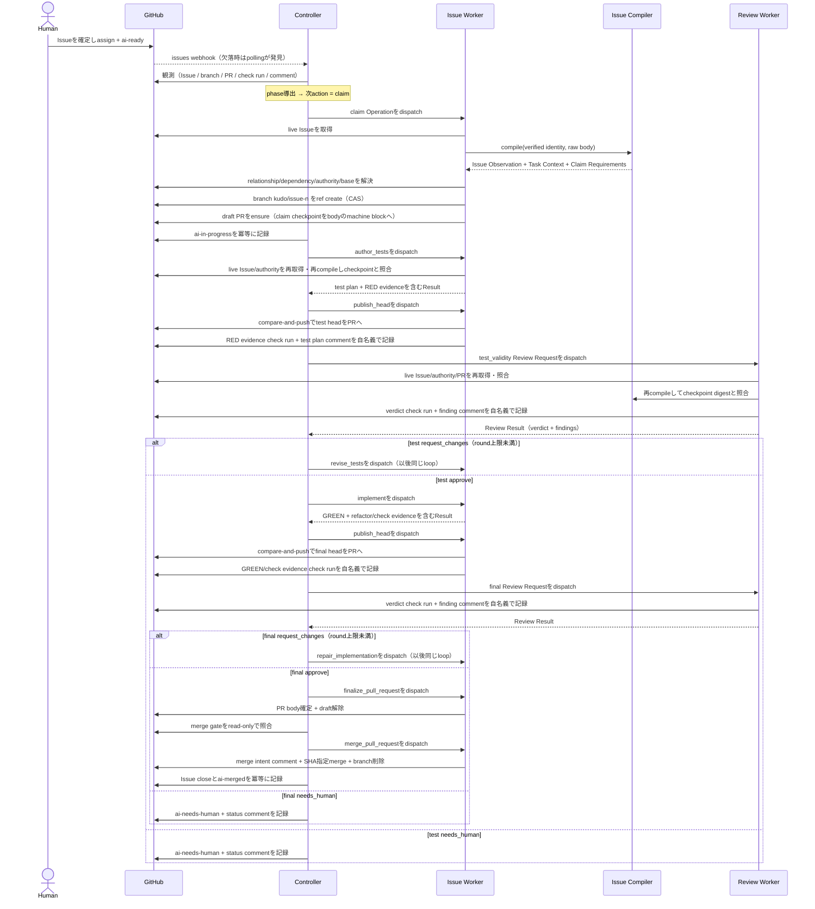

# End-to-end workflow

## Purpose

本書は、人間が Task Issue を準備してから、Kudo が Pull Request を作成し、承認済み head を merge して
Issue を close するまでの規範的な順序を定義する。外部 protocol の field は
[Issue Contract](contracts/issue-contract-v1alpha1.md) と
[Implementation–Review Protocol](contracts/review-protocol-v1alpha1.md) を正とする。

## Actors

- Human Author: Issue Contract を完成させ、`mrbaron3`を assign し、`ai-ready`で実行を依頼する。
- Controller（Coordinator）: GitHub を観測して phase を導出し、Operation を in-process dispatch し、
  label と status comment を記録する。evidence や verdict を代筆せず、model session も持たない。
- Issue Worker（Implementer）: 変更の author。各 Operation で live Issue を compile し、専用
  worktree、branch、test、source、commit、Pull Request を変更できる。自分の実行証跡（evidence
  check run）を自分の名義で記録する。
- Review Worker（Reviewer）: 判定の author。各 Review Operation で live Issue を compile し、
  read-only checkout と head に束縛された evidence から判定し、verdict check run と finding comment
  を自分の名義で記録する。判定対象（source、branch、PR の状態・本文）には不可侵である。
- actor と発話の対応、identity 分離の規範は [architecture.md](01_architecture.md) の Actor model を
  正とする。
- GitHub: live Issue、repository、Pull Request の source of truth であり、同時に workflow 状態の
  唯一の永続表現（record surface）である（[ADR-0001](../../adr/0001-github-ssot-stateless-reconciler.md)）。

## Preconditions

人間は `.github/ISSUE_TEMPLATE/kudo-task.md` を使い、次を満たす。

1. required section と Contract block をすべて確定する。
2. `kind: task`、`readiness: ready`にする。
3. Acceptance Criteria を観測可能な Given/When/Then で書き、ID を Contract block と一致させる。
4. 参照すべき仕様を`authorityRefs`へ優先順位の高い順に列挙する。
5. `mrbaron3`を assign する。
6. 最後に`ai-ready`を付ける。

`ai-ready`は契約内容ではなく、完成した契約に対する one-shot execution request である。

## Normal flow

Controller と Worker の間に queue はない。Controller が「Operation を発行する」とは、導出した phase
から versioned Operation / Review Request の envelope を組み立て、in-process の該当 handler を呼ぶ
ことをいう。record surface への記録は発話の主体が自分の identity で行い、Worker は記録を終えてから
Result または Attempt Failure を in-process で返す。Controller は記録の存在・binding・作成 identity を
検証して次の transition を決める。process が途中で消えた場合、restart 後の再観測が同じ phase を導出
し、同じ action を新しい fresh attempt として再実行する。重複は marker と CAS が防ぐ。

### 1. Discovery and reconciliation

Webhook adapter は署名を検証し、IssueRef に対する reconcile を trigger する。定期 poller は起動時と
既定15分ごとに、configured repository の open Issue を検索する。どちらも同じ
`ReconcileIssue(IssueRef, Trigger)`を起動し、payload 内の Issue body を実装入力にしない。

Reconciliation は live GitHub state で candidate 条件を確認する。条件を満たさない Issue は
`skipped_not_candidate`として終了し、失敗や escalation にしない。

### 2. Claim

claim handler は GitHub から現在の Issue を直接取得し、verified Issue identity と raw body を pure な
Issue Compiler へ渡す。Issue Compiler だけが Contract、section、Acceptance Criteria を strict parse
し、Issue Observation、canonical Task Context、Claim Requirements を返す。Context Resolver は Claim
Requirements に従って native relationship、dependency、authority、base commit を live source から
解決し、Context Manifest identity を計算する。

claim の排他は branch `kudo/issue-<n>`の ref create で行う。ref create は atomic であり、既存 branch
がある Issue は claim できない（active Run が存在するか、supersede の後始末が未完了である）。branch
作成に続けて、Issue Worker は base から bootstrap commit を積み、draft Pull Request を冪等に ensure
する。PR body の machine block に claim checkpoint（Compiler version、Task Context ref、Context
Manifest ref、Execution / Escalation Policy ref、base SHA）を記録する。この PR が Run の記録面であり、Run identity
は PR 番号である。

raw Issue body、Issue Observation YAML、Task Context YAML、Context Manifest YAML はどこにも保存
しない。Controller は schema、digest、binding を検証するが、raw Issue body または Task Context の
prose を再解釈しない。claim 完了後、Controller は`ai-ready`を外し`ai-in-progress`を記録する。label
記録が一時的に失敗しても Run は巻き戻らず、次の reconcile が記録を収束させる。

### Live context reconstruction

claim 後に Task Context を必要とする Issue Worker / Review Worker Operation は、開始時に次を行う。

1. PR body の machine block から claim checkpoint を読む。
2. GitHub から live Task Issue を取得し、claim 時と同じ Compiler version で strict parse する。
3. pin 済み base SHA から repository authority を、GitHub から Issue authority を取得し、Context
   Manifest を再計算する。
4. Task Context ref と Context Manifest ref を checkpoint の期待値と比較する。
5. 一致した canonical Task Context と authority content だけを in-memory の model input として使う。

Operation 完了時にも同じ比較を行う。開始時または完了時に identity が一致しなければ Result や review
verdict を確定せず`stale_input`として Controller へ返す。raw body だけの非意味的差分で Task Context /
Context Manifest が一致する場合は観測を telemetry に残して継続する。canonical bytes は Attempt 終了時に
破棄し、次 Operation へ渡さない。

model session を持たない`finalize_pull_request`と`merge_pull_request`も、開始時に同じ再構築と照合を
行う。final approve 後に Issue が意味的に編集される窓を検出できる最後の enforcement point であり、
merge は取り消せない mutation だからである。完了時の照合は要求しない。`publish_head`は対象外で、
publish 後の staleness は次の Review Request の開始時照合が検出する。

### 3. Test authoring and RED

Issue Worker は fresh provider session で`author_tests`を実行する。session には直前に live source から
再生成して期待 digest と一致した canonical Task Context、authority content、base/head SHA、明示された
policy だけを渡す。raw Issue body は compile 入力であり、canonical Task Context と重ねて model input へ
渡さない。

test plan は各 Acceptance Criteria と test case の対応を示す。テストを追加した head で規定 command を
実行し、対象機能の欠如に起因する期待どおりの failure を RED evidence として固定する。環境故障、
compile infrastructure failure、無関係な既存 failure を RED とみなさない。

RED 固定後、Controller は`publish_head`を発行する。Issue Worker は期待 head と live branch head を
照合してから push し（compare-and-push）、続けて test plan の marker comment と RED evidence
（command、exit status、出力抜粋、environment identity）の evidence check run を test head へ自分の
名義で記録する。finding や evidence が check run output の上限（64KiB）を超える場合は決定論的に
truncate し、全文の digest を併記する。draft PR 上の CI が RED になるのは TDD の位相の正直な表示で
あり、隠すために publish を遅らせない。全 review round はこの同一 draft PR へ繋留される。

### 4. Test validity review

Controller は published head へ束縛された`test_validity` Review Request を作り、
[Test Validity Review Policy](review-policies/test-validity-v1alpha1.md) を`policyRefs`へ含める。
required policy ref が欠落した Request は binding 境界で reject され、reviewer の推測で補わない。
policy 取得の transport failure も quality verdict へ変換しない。

Review Worker は live Issue を再 compile して Task Context / Context Manifest identity を照合し、live
PR の open / draft 状態・head / base も照合する。context、head、base の不一致は品質 verdict ではなく
stale、Kudo 自身の merge intent に紐付かない close / merge は品質 verdict に変換せず人間へ escalate
する。そのうえで fresh session と別の read-only checkout を使い、再生成した canonical Task Context、
Acceptance Criteria、test plan、test diff、RED evidence を policy の標準観点で評価する。

- `approve`: Review Worker が verdict check run を head へ自分の名義で記録し、implementation へ進む。
- `request_changes`: Review Worker が verdict check run と finding comment を記録して blocking finding
  を versioned Result として返す。Controller は同じ Run / worktree を所有する Issue Worker の新しい
  `revise_tests` session へ finding を渡す。
- `needs_human`: 自動修正できない authority または安全判断として workflow を停止する。

`request_changes`が`test_validity`の round 上限に達した場合、Controller は`revise_tests`を発行せず
`needs_human`phase へ送る。verdict は`request_changes`のままであり、上限判定は Controller だけが行う。

「元の作業へ差し戻す」とは同じ論理 lane と worktree を使うことであり、以前の provider conversation を
resume することではない。修正後は新しい head を同一 draft PR へ再 publish し、新しい Review Request を
作り、再 review する。

### 5. GREEN and refactor

test validity approval 後にだけ、Issue Worker は fresh`implement` session を開始する。入力は live
source から再生成して期待 digest と一致した canonical Task Context / authority、approved test /
result、現在 head であり、raw Issue body、test author または reviewer の transcript ではない。

implementation は次を順に満たす。

1. 承認済み test を変更せずに production code を実装する。
2. 対象 test と必要な回帰 test を通し、GREEN evidence を固定する。
3. behavior を保ったまま重複、命名、構造を refactor する。
4. Issue の Verification と repository の required checks を再実行する。
5. test 変更が必要になった場合は implementation 中に書き換えず、test authoring/review gate へ戻す。

`implement`または`repair_implementation`が承認済み test の変更を必要とする場合、その Result を GREEN
完了として受理しない。Issue Worker は未承認の test/production 変更を最後に承認された test checkpoint
へ rollback し、rollback 済み head と根拠の`test-revision-report`を持つ`test_revision_required`
Result を返す（[Worker Operation Protocol](contracts/operation-protocol-v1alpha1.md)）。この差し戻しは
quality verdict でも execution failure でもなく、`test_validity` gate の無人 round 予算を1消費する。
予算が残る場合、Controller は report と rollback 済み head を入力に`revise_tests`を fresh session で
dispatch する。上限に達した場合は`review_round_limit_exceeded`として`needs_human`へ送る。変更後の
test head と RED evidence を同一 draft PR へ publish し、新しい`test_validity` approval を得るまで
implementation へ戻らない。これにより、implementation lane が test review gate を迂回して承認済み
test を書き換える経路を閉じる。

GREEN と refactor の evidence が固定された後、Controller は`publish_head`で final head を同一 draft
PR へ publish させる。Issue Worker が GREEN / check evidence check run を final head へ自分の名義で
記録してから、final review を開始する。

### 6. Final implementation review

Controller は final head へ束縛され、approved test の verdict check run、GREEN/refactor/check
evidence check run を参照し、[Final Implementation Review Policy](review-policies/final-implementation-v1alpha1.md)
を`policyRefs`へ含む`final_implementation` Review Request を発行する。Review Worker は fresh
read-only session で常時必須の correctness、regression、scope、test quality、code quality、security、
evidence を評価する。approved test head から final head までの diff に test 変更が含まれる場合は
approve できない（test gate の迂回検出）。条件付き観点（UX、accessibility、type design、performance）
の適用可否は同じ session が policy の適用条件から判断し、観点別の applicability 宣言（理由 code と
evidence 付き）として Result へ残す。宣言を欠く Result は binding 境界で受理されない。

`request_changes`は fresh`repair_implementation` session へ handoff し、修正後の head に新しい review
を要求する。head が変われば以前の approve は stale である（新しい head には verdict check run が
存在しないため、構造的に再 review が要求される）。`needs_human`は自動 loop を停止する。
`final_implementation`の round 上限に達した`request_changes`も、`repair_implementation`を発行せずに
自動 loop を終了させる。counter は`test_validity`と独立であり、test 側で消費した round は final 側の
予算に影響しない。

### 7. Pull Request finalize

Pull Request 自体は claim 直後から draft として存在する。final approve の verdict check run が live
PR head と一致する head に存在する場合だけ、Issue Worker は`finalize_pull_request`で required PR body
を確定し draft を解除する。ready 化だけが final approve を gate とする。確定後の PR body は
`.github/pull_request_template.md` の必須項目を満たし、少なくとも次を含む。

- Task Issue link と closing keyword
- outcome と変更範囲
- RED / GREEN / refactor 後 verification の evidence check run への対応
- test validity と final implementation の verdict check run への対応
- Acceptance Criteria との対応
- 残存 risk と人間が確認すべき事項
- base SHA、head SHA

### 8. Merge と完了投影

ready 化の後、Controller は merge gate を評価する。条件は、final approve verdict check run と live PR
head の一致、live PR の open / base 一致、required status check の success、mergeable の4点がすべて
成立することである。review に merge 判断をさせず、外形条件を Controller が read-only の pull request
/ check 観測で評価する。required check の pending は品質 verdict でも execution failure でもなく、
backoff 再照合する待機であり、retry budget を消費しない。execution deadline を超えた pending、check
failure、conflict、branch protection の拒否では`merge_blocked`として`needs_human`へ送る。

Issue Worker は`merge_pull_request`の開始時に live context を再構築・照合し、mutation 直前にも live
PR の open / base / head を再照合したうえで、まず merge intent comment（対象 head SHA を含む marker）
を記録し、期待 head SHA を明示した merge で merge commit を作る。head branch を冪等に削除する。
GitHub が merge を拒否した場合は、品質 verdict へ変換せず、拒否の観測を evidence とした
`needs_human` Result として返し、Controller が`merge_blocked`として扱う。merge method は merge
commit に固定し、squash と rebase は承認済み commit lineage を base 側で失わせるため使わない。

merged の観測後、Controller は Task Issue を close し、`ai-in-progress`を外して`ai-merged`を記録
する。これが Kudo の正常 terminal である。release、deploy、merge 後の revert 判断と、merge 後に付いた
PR review comment への対応はこの workflow の外に置く。

Run 中に人間が同 branch へ push した場合、base を変更した場合、Kudo の merge intent と無関係に PR を
close / merge した場合は外部干渉であり、compare-and-push、merge 時の期待 head 照合、review の live
照合で検出する。branch push による head 不一致と base 変更は stale、intent に紐付かない close /
merge は品質 verdict に変換せず人間へ escalate し、blind に上書きしない。記録済み merge intent
comment と一致する merged 観測は自分の mutation の再観測であり、干渉として扱わず成功へ収束させる。

## Derived phases

phase は保存されず、GitHub の観測から次の規則で導出する。上から順に評価し、最初に成立した行が現在
phase である。

| Phase | 導出条件 |
| --- | --- |
| `needs_human` | Issue に`ai-needs-human` label がある |
| `merged` | kudo PR が merged である |
| `superseded` | kudo PR が merged 以外で closed である（lineage として残る） |
| `merging_pull_request` | PR が ready で、live head に final approve verdict check run がある |
| `finalizing_pull_request` | PR が draft で、live head に final approve verdict check run がある |
| `awaiting_final_review` | live head に GREEN/check evidence check run があり、verdict check run がない |
| `implementing` | live head 系譜に test approve verdict check run があり、final evidence がまだない |
| `awaiting_test_review` | live head に RED evidence check run があり、test verdict check run がない |
| `authoring_tests` | draft PR が存在し、live head に RED evidence check run がない |
| `claimed` | branch `kudo/issue-<n>`が存在し PR がまだない（claim 続行中または中断） |
| candidate | Issue open + `ai-ready` + dependency 完了 + kudo branch なし |

`request_changes`の verdict check run がある head に新しい commit が積まれると、新 head には check
run が存在しないため、evidence の再記録と再 review が構造的に要求される。導出関数は上記いずれにも
該当しない観測（branch はあるが commit が壊れている等）を`needs_human`へ写像し、黙って進行しない。

## Retry and round budget

retry 可能な transport / execution failure は quality state ではなく process-local な attempt 管理で
backoff 再実行する。provider session は Attempt ごとに新規作成する。retry budget は claim 時に
Escalation Policy として pin し、既定`3`は初回後の追加 Attempt を最大3回まで許す。同じ logical
Operation 内の timeout、rate limit、network、provider crash、GitHub transport、provider invalid
response で共有する。immutable input に対する protocol validation error は同じ input で成功し得ない
ため retry せず、`protocol_validation_failed`の`needs_human`へ送る。attempt counter は process-local
であり、process 再起動で失われるが、round 予算と escalation が無人 loop の外側の防波堤になる。

### Review round 上限

`request_changes`による自動修正 loop には gate ごとの round 上限がある。

- 上限は claim 時に Escalation Policy から Run へ固定し、その値と digest を escalation 時の status
  comment に記録する。`test_validity`と`final_implementation`は独立した counter と独立した上限を持つ。
- counter は Reviewer 名義の marker 付き verdict 記録（finding comment）から導出する。作成 identity
  で数えるため、他 actor や人間の投稿と構造的に区別できる。`test_validity`の counter は
  さらに、implement lane が返した`test_revision_required`の記録でも1を消費する。どちらも test gate を
  再び開く差し戻しであり、無人区間の churn を有限にするという予算の意図は同じである。attempt
  failure、stale input、transport failure、protocol validation error は round を消費しない。
- 上限が縛るのは**無人区間**、すなわち直近の`ai-ready`付与イベント以降の round 数である。Run の生涯
  round 数は PR 上の全 marker の計数として別に導出でき、ledger と telemetry が使う。
- 上限に達した round の verdict が`request_changes`の場合、Controller は修正 Operation を発行せず、
  理由 code `review_round_limit_exceeded`で`needs_human`へ送る。上限に達していても`approve`は次の
  gate へ進む。
- 上限判定は Controller の gate 判断であり、review の品質基準ではない。reviewer へ round 数、上限、
  過去 round の結果を渡さない。

## Escalation and resumption

`needs_human`では、Controller が理由 code、停止 phase、必要な対応、evidence への参照と、停止時の
`ResumeIdentity`を status comment の machine block へ記録してから`ai-needs-human`を付ける。人間は
Issue 本文または明示された authority を修正し、再度`ai-ready`を付ける。

`ResumeIdentity`は単一 digest ではなく、次の二層から成る複合 identity である。

| 層 | field |
| --- | --- |
| `InputIdentity` | `ContextManifestRef`、`ExecutionPolicyRef` |
| `CheckpointIdentity` | 停止 phase、phase で有効な head 群、Pull Request ref、test/final approval の verdict check run binding（request digest）、ordered `policyRefs` |

Escalation Policy と無人区間 counter は semantic input ではないため含めず、同じ Run を resume する
ときは claim 時に pin した Escalation Policy を継続して使う。optional な checkpoint field は停止
phase で未作成なら欠落として固定し、「現在は値が無い」ことも比較対象にする。

再 reconciliation は live Issue / authority を再取得して同じ Compiler version で Task Context /
Context Manifest identity を再計算し、記録済み ResumeIdentity と live PR を照合して現在の Resume
Identity を再構築する。

- **resume**: 人間による`ai-ready`再付与があり、Resume Identity 全体が同じ場合だけ、`ai-needs-human`
  を外して保存済み停止 phase の action を fresh Attempt で再 dispatch する。
- **supersede**: `ContextManifestRef`または`ExecutionPolicyRef`が変わり、valid な新規 input を構築
  できる場合は古い PR を close し branch を削除して superseded とし、新しい claim（新しい branch と
  PR）を作る。古い approval を新しい入力へ移し替えない。
- **checkpoint 不一致**: head、policy ref、PR ref、approval binding のいずれかだけが変わった場合は
  以前の approval を stale とし、同じ Run を resume しない。valid な新規 input として安全に claim
  できる場合だけ supersede し、PR close / merge 等でできない場合は`needs_human`を維持する。
- **observation-only 差分**: Issue の raw body 差分で Task Context / Context Manifest が変わらない
  場合は同じ Resume Identity として扱う。

attempt retry と review round の予算は無人区間ごとに与える。人間へ差し戻した時点で区間が終わるため、
escalation の理由 code によらず区間 counter は 0 へ戻る（counter の導出起点が直近の`ai-ready`付与に
なる）。生涯 round 数は PR 上の全 marker から導出でき、reset しない。

- **resume**（同じ Run の再開）: 満額の予算から始まる。counter を継続すると、人間が修正した後の
  review が予算 0 になり、次の`request_changes`で即座に再 escalate する。1 round で収束する修正にも
  automation が追従できず、round 上限が loop を「1 回だけ動く仕組み」へ退化させてしまう。
- **supersede**（新しい Run）: 新しい PR なので当然 0 から始まる。
- **生涯 counter**: 停止した Run が通算で何 round を費やし、何回差し戻されたかは PR timeline から
  導出する。差し戻しを繰り返す Run はこの数字で識別する。

`ai-ready`は人間所有の trigger であり、resume には人間の明示的な操作と escalation comment の確認が
毎回必要になる。予算の再付与は無人の暴走ではなく、人間が状況を見て継続を選ぶ行為である。生涯 round
/ Attempt 数に対する上限は置かない。人間が介入しても gate を通らないことは予算不足ではなく、
Contract、authority、分割の粒度、Execution Policy、外部環境のいずれかが誤っている signal であり、
その判断は差し戻しのたびに人間が行う。

`needs_human`は実行を停止した paused Run であり、同じ Issue に新しい Run を無条件で作れる状態では
ない。branch が残っている限り新しい claim は ref create で失敗するため、supersede の後始末（PR
close、branch 削除）が完了してからだけ新しい Run を作れる。

## Idempotency and recovery

- polling と webhook は同じ IssueRef に対して同じ reconciliation rule を使う。webhook の重複配送は
  観測の再実行になるだけで、mutation は marker と CAS が防ぐ。
- 1 IssueRef に active Run（open な kudo PR / branch）は最大一つ。排他は branch ref create で行う。
- worktree / branch / PR mutation は期待 head を明示した CAS（compare-and-push、SHA 指定 merge）で
  重複と外部干渉を同時に防ぐ。
- check run / comment / label の記録は marker を検索してから行う冪等 mutation とする。
- process 停止後は再観測が phase を再導出し、未完了の action を新しい fresh Attempt として再実行
  する。workspace が失われた場合は base と published head から再構築する。
- Run 中に Context Manifest ref（base を含む）、Execution Policy ref、head、policy ref、PR ref、
  approval binding が変われば進行を止め、以前の review を stale にする。Issue の raw body だけの
  非意味的差分は telemetry へ記録し、Operation identity と approval を維持する。
