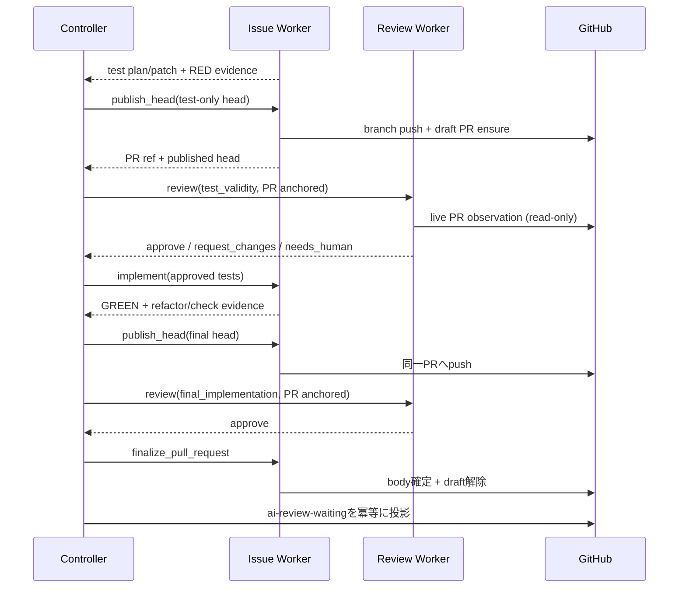
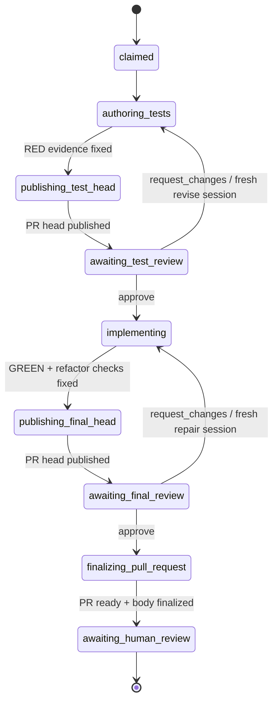

# ADR-0002: PR-anchored review と Review Worker 設計

- Status: accepted（2026-08-18）
- 関連Issue: [#25](https://github.com/mrbaron3/kudo/issues/25)、[#28](https://github.com/mrbaron3/kudo/issues/28)、[#29](https://github.com/mrbaron3/kudo/issues/29)、[#43](https://github.com/mrbaron3/kudo/issues/43)、[#44](https://github.com/mrbaron3/kudo/issues/44)、[#47](https://github.com/mrbaron3/kudo/issues/47)
- 実装Task: [#49](https://github.com/mrbaron3/kudo/issues/49)（本ADRの確定とprotocol/workflow改訂）
- Supersede対象: [migration-from-servo.md](../../06_project/03_migration-from-servo.md)「New Kudo decisions」の「PR作成前のfinal implementation review gate」、および[workflow.md](../02_workflow.md) §6–7のPR作成順序
- Supersedeされた箇所: D1のterminal記述は[ADR-0005](0005-auto-merge.md)が置き換える。ready化はhandoff terminalではなくmergeの前提段階になった
- Supersedeされた箇所: Issue freshnessの保存済みObservation照合は[ADR-0006](0006-live-context-reconstruction.md)がlive再compileへ置き換える

## Context

現行workflowはfinal implementation reviewのapproveをPull Request作成の前提gateとし、PRは正常handoffの終端でだけ作られる。一方でServoのレビューは全観点を毎回評価するpanel方式であり、Kudoは#47のversioned policyで常時必須観点と条件付き観点を分離した。しかし次の3点は未設計である。

1. レビューを起動・繋留する単位。現行はController内部のRun状態だけが起点で、人間はfinal approveまで何も見えない。
2. 条件付き観点の適用可否を「誰が・いつ・どう」判定するか。policyは適用条件を定義したが、判定の実行主体と監査可能性は決めていない。
3. `request_changes`後の再reviewラウンドで評価範囲をどう扱うか。

製品判断として「レビューの起点はPRとする」を採用し、上記3点を同時に決める。

## Decision

### D1. 全review roundをPRへ繋留する

- Issue WorkerはRED evidence固定後、branchをpushしdraft Pull Requestを冪等に作成する。
- `test_validity`と`final_implementation`の全Review Requestは、このPRとそのhead SHAへ繋留される。
- final approveはPR作成ではなく、PR bodyの確定とdraft→ready遷移をgateする。ready化とai-review-waiting投影がhandoff terminalである（terminalは[ADR-0005](0005-auto-merge.md)が`merged`へ置き換えた）。
- PR mutationの権限はIssue Workerだけが持つ現行のmutation authorityを変更しない。Review WorkerはPRのread権限だけを追加で得る。

### D2. 観点の適用可否はreview sessionが判断し、Resultへ構造化して残す

- 事前の観点選択stage（rule classifierや別のmodel呼び出し）を置かない。条件付き観点の適用条件はpolicyの表を正本として全てsessionへ渡し、品質を判定するのと同じfresh sessionが適用可否の判断と適用観点の評価を行う。
- Review Resultは全条件付き観点について`applicable`、機械判定可能な`reason` code、`evidenceRefs`を持つapplicability宣言を必須とする。宣言が欠けたResultはbinding境界で受理しない。
- 決定論に残すのは機械的に検証できる部分だけとする: 判断入力（canonical Task Context、immutable diff/artifact）のdigest固定、applicability宣言の形式検証、performance bound宣言の検出とbound宣言時の測定evidenceの数値照合。
- 適用判断の再計算可能性は要求しない。監査要件は「何をなぜ評価対象外としたか」が構造化されてevidenceへ辿れることで満たす。適用可否は変更の意味に対する判断であり、path patternやfile classの代理変数へ写像しない。

### D3. 再reviewラウンドで観点を縮小しない

- 各roundは、そのroundの適用判断で適用となった観点をすべて再評価する。前roundの観点別結果を持ち越さない。
- コスト削減はD2の適用判定と、修正roundのdiffが自然に小さいことで得る。delta-scoped再reviewと観点別verdict cacheは採用しない（「未決事項」参照）。

## 設計詳細

### 1. PR lifecycle

PRはRunの人間可視なanchorであり、「publish」を単位に更新される。publish = branch pushとPR ensure/updateの冪等な組。

| 時点 | PR操作（Issue Worker） | 内容 |
| --- | --- | --- |
| RED固定後 | draft PR作成（初回publish） | test-only headをpush。bodyはTask Issue link、Run ID、phase、test plan要約をartifactから決定論的に生成 |
| revise_tests後 | 同一PRへpublish | 新test-only head。bodyのphase節を更新 |
| GREEN/refactor後 | 同一PRへpublish | final head。bodyへ実装要約を追記 |
| repair後 | 同一PRへpublish | 修正head |
| final approve後 | body確定 + ready化 | `.github/pull_request_template.md`の必須項目を確定しdraftを解除 |

- publishはIssue Workerのidempotency keyと期待head照合（compare-and-push）で二重mutationと外部干渉を防ぐ。
- PR body更新はartifactから決定論的に生成し、source headを変えないためreview bindingを壊さない（既存契約の規則を維持）。
- PR bodyは自動管理であることを明記し、人間の編集はhandoff後まで想定しない。
- 外部干渉はlive PR observationとreconciliationで検出する。同branchへのpushによるhead不一致とbase変更はstale、PRのclose/mergeはRunを`needs_human`phaseへ送るため人間へescalateする（Kudo自身のmergeとの区別は[ADR-0005](0005-auto-merge.md) D6が追加した）。PR body編集とdraft/ready遷移だけの差分はaudit lineageへ追記し、いずれも品質verdictには変換しない。
- draft PR上のCIはtest-only headではREDになる。これは隠すべき異常ではなくTDDの位相の正直な表示であり、required checksのenforcementはready遷移時にのみ意味を持つ。

### 2. Workflow変更



Run phaseは次のとおり変わる。`preparing_pull_request`は`finalizing_pull_request`（body確定とready化）に置き換わり、各review roundの前に`publishing_*_head`が入る。



（`needs_human`への遷移は現行と同じく全phaseから可能。図は正常経路のみ示す。）

gate semanticsの差分:

- `test_validity`のapproveは、test-only headがlive PR headと一致してbindされている場合だけ`implement`を許可する。
- `final_implementation`のapproveは、final headがlive PR headと一致してbindされている場合だけ`finalize_pull_request`（body確定 + ready化）を許可する。
- ready遷移前にheadが変わればapproveはstaleであり、再publishと再reviewが必要になる。
- 「review中は対象headを変更しない」invariantは維持する。publishでheadを固定してからRequestを発行する。

### 3. Contract変更

[review-protocol-v1alpha1](../contracts/review-protocol-v1alpha1.md)を改訂する。protocolはalphaで外部consumerを持たないため、version名は`v1alpha1`のまま文書・parser・fixture・testを同時に変更する（contract discipline）。

#### Review Request

```yaml
schema: kudo.review-request/v1alpha1
kind: test_validity
pullRequest: github://owner/repository/pull/57
pullRequestObservation:
  schema: kudo.pull-request-observation/v1alpha1
  digest: sha256:<digest>
# 既存field（issue、headSha、contextManifest、executionPolicy、artifactManifest、policyRefs等）は変更なし
```

- `pullRequest`はrequest identityに含める。同じheadでも別PRへのrequestは別identityである。
- `pullRequestObservation`は`issueObservation`と対称のaudit lineageであり、identityに含めない。live PRの観測結果（PR ref、open/closed/merged、draft、head SHA、base ref、body digest）を`kudo.pull-request-observation/v1alpha1` artifactとして固定する。観測時刻はcanonical contentに含めず、Artifact Storeのmetadataが持つ。同じ状態の再観測が別identityになると、意味のない差分でlineageが伸びるためである。

#### Review Resultのapplicability宣言

Review Resultへ`perspectives`を追加する。条件付き観点を持つkind（`final_implementation`）では、全条件付き観点のapplicability宣言が揃っていないResultをbinding境界で受理しない。`test_validity`は条件付き観点を持たないため`perspectives`を持たない。

```yaml
schema: kudo.review-result/v1alpha1
requestDigest: sha256:<digest>
verdict: approve
perspectives:
  - perspective: ux
    applicable: false
    reason: no-user-facing-surface-change
    evidenceRefs:
      - sha256:<digest>
  - perspective: accessibility
    applicable: false
    reason: no-ui-surface-change
    evidenceRefs:
      - sha256:<digest>
  - perspective: type-design
    applicable: true
    reason: exported-signature-changed
    evidenceRefs:
      - sha256:<digest>
  - perspective: performance
    applicable: false
    reason: no-bound-and-no-perf-surface
    evidenceRefs:
      - sha256:<digest>
findings: []
```

- `reason`は機械判定可能なcode値とする（#45のerror taxonomyと同じ方針）。自由記述の補足はfindingではなく`evidenceRefs`が指すartifactへ置く。
- `perspectives`は判断の一部としてResult identityへ含め、`findings`と同じくperspective名のcanonical順へ正規化する。
- 宣言はreviewer自身の判断であり、handlerやControllerが代筆・補完しない。宣言の欠落は品質verdictではなくprotocol violationとして拒否する。

#### Review Result

- verdictは`approve`、`request_changes`、`needs_human`の3種を維持し、新しいverdictを追加しない。
- 適用可否の判断に必要なauthorityが不足し、適用有無で結論が変わる場合の`needs_human`は、policyの既存規則をそのまま使う。

#### Staleness追加規則

- live PR headがrequestの`headSha`と一致しない場合は品質verdictを返さず、stale inputとしてControllerへ返す。
- PRが外部でclose/mergeされた場合は品質verdictを返さず、Runを`needs_human`phaseへ送るため人間へescalateする。
- PR baseはclaim時のbaseと一致しなければならない。不一致はstale（Context Manifest経由のbase staleness判定と同じ扱い）とする。

### 4. 観点適用判断とsession assembly

適用可否の正本は[Final Implementation Review Policy](../review-policies/final-implementation-v1alpha1.md)の条件付き観点表（適用条件と主な確認事項）である。本ADRはrule classifierを定義せず、適用条件をpath patternやfile classの代理変数へ写像しない。適用可否は変更の意味に対する判断であり、品質判定と同じsessionが同じ根拠（canonical Task Contextとimmutable diff/artifact）から行い、結果を観点別applicability宣言としてResultへ残す。

- performanceの適用は「boundの宣言」または「性能が問題になりやすい実行surface（frontend、batch/job）の変更」で決まる。宣言も該当surfaceもないと判断した場合の非適用宣言は、policyの適用条件に忠実な既定である。
- 非適用の宣言には理由codeと、判断根拠となったTask Context節やdiff範囲を指すevidenceを必須とする。宣言のないResultは受理しない。

#### Performance measurement evidence

性能の**測定**はreviewの中で実行しない。Review Workerはread-onlyかつimmutable inputだけからverdictを導く役割であり、測定は本質的に非決定的（環境・負荷・回数で揺れる）なため、review中に実行するとverdictの再現性と監査可能性が壊れる。測定はRED/GREENと同じevidenceパターンに従う。

- Issue Workerがrepositoryの標準commandとして測定harnessを実行し、command、固定した実行条件（throttling、viewport、データ量等）、環境identity、複数回実行の要約（run数とmedian）をevidence artifactに固定する。web UIはLighthouse CLI / Lighthouse CIの固定構成、batch/jobは`go test -bench`または実行時間・throughput計測harnessを想定する。
- model sessionへ渡す表現はYAML summary（metrics、実行条件、run数、median）とする。raw report（LighthouseのJSON/HTML等）はaudit用bytesとして保存してよいが、model inputにしない。
- Task Contextまたはauthority（例: repositoryのperformance budget文書を`authorityRefs`で参照）にboundが宣言されている場合、bound充足は数値比較としてdeterministic prerequisiteで機械照合できる。reviewerが判定するのは測定方法の妥当性とresidual riskである。
- chrome-devtools MCPのようなinteractive測定toolはruntime review pathに置かない。Issue Workerのprovider sessionが探索的に使うかはExecution Policyのtool policyの問題であり、evidenceとして固定されるのはharness実行結果だけである。
- performance boundが宣言されたTaskに限り、測定evidenceのlogical nameを`performance-evidence`として必須化する。bound宣言がなく実行surfaceだけでperformance観点が適用される場合、測定evidenceをdeterministic prerequisiteにはしない。

session assemblyは次のとおり。

- promptにはcanonical Task Context、該当kindのpolicy本文（条件付き観点の適用条件を含む全体）、artifact reference、verdict規則を渡す。観点を事前に間引かない。
- sessionは各条件付き観点の適用可否を先に判断してapplicability宣言を作り、適用と判断した観点だけを深く評価する。
- 適用可否の判断に必要なauthorityが不足し、適用有無で結論が変わる場合は`needs_human`とする（policyの既存規則）。
- 1つのfresh sessionが適用可否の判断と全適用観点の評価を行う。観点ごとのsession fan-outはしない（policyの既存規則を維持）。

### 5. Review Worker handler pipeline

`internal/reviewworker/`のhandlerは1つのRequestを次のpipelineで処理する。1〜5はmodel session起動前の決定論的段階であり、失敗はすべてprotocol/staleness/execution failureとして返す。6以降だけが品質判断を作る。

1. **Lease**: role=reviewのqueued Requestをleaseし、heartbeatを維持する。
2. **Protocol validation**: strict parse。Request identityを構成するref群のschema+digest binding検証。
3. **Live freshness**: Issue側は[ADR-0006](0006-live-context-reconstruction.md)に従ってTask Context / Context Manifestをlive再構築し、PR側はlive PRを取得してopen状態・head一致・base一致・draft状態を確認して`pull-request-observation` artifactを固定する。headまたはbaseの不一致はstale、close/mergeは品質verdictを返さず、Runを`needs_human`phaseへ送るため人間へescalateし、PR body編集またはdraft/ready遷移だけの差分はaudit lineageへ追記する。
4. **Artifact resolution**: manifestの全entryをdigest/length照合で取得し、immutable source snapshotから`headSha`検証済みdisposable checkoutを構築する。
5. **Deterministic prerequisites**: policy §1の機械検証（binding整合、approved-test lineage、evidenceのhead binding、bound宣言時の測定evidenceの数値照合）。
6. **Session**: fresh provider processへ組み立てたcontextを渡す。structured output（YAML applicability宣言とfindings）をstrict parseし、不正outputはbounded retry後にexecution failureとする。
7. **Result構築**: verdict/finding整合（`approve`にblockingなし、`request_changes`/`needs_human`にblocking必須）と、条件付き観点のapplicability宣言の完全性を検証し、canonical encodeしてartifact追記、Operation resultを一度だけ記録する。
8. **Failure taxonomy**: timeout/rate limit/network/provider crashはattempt failureとしてretry可能に記録する。品質verdictとfailureを同じfieldに載せない。

package配置と主なtest（TDDで先にテストを書く）:

- `internal/contract`: `pullRequest` identity、applicability宣言の完全性・canonical正規化、`pull-request-observation` schemaのfixture・canonical test
- `internal/reviewworker/handler.go`: GitHub PR reader・provider・Artifact Storeのfakeによるpipeline test。stale PR、外部close、applicability宣言欠落の拒否を含む
- `internal/workflow`: 新phase遷移（publishing_*、finalizing_pull_request）のpure transition test

### 6. コストモデル（Servo対比）

| | Servo | Kudo（本設計） |
| --- | --- | --- |
| session数/round | 観点ごとのfan-out | 1 fresh session |
| 評価観点/final round | 全7観点を毎回 | 常時必須6 + 適用条件付き0〜4 |
| 評価観点/test round | （test qualityも全panel内） | test専用5観点 |
| 再round | 全観点を再panel | 適用観点の全再評価（diffは自然に小さい） |
| 観点選択の監査 | なし（常に全部） | Resultのapplicability宣言に理由とevidence付きで固定 |

典型的なbackend-only Taskのfinal reviewは10観点でなく6観点で済み、除外理由は機械検証可能な形で残る。

## Consequences

### 影響を受ける文書・Issue

| 対象 | 変更 |
| --- | --- |
| workflow.md | §3以降の順序（publish挿入、PR作成時点、finalize/ready化）、state図、gate semantics |
| architecture.md | Issue Worker（早期publish責務）、Review Worker（PR read、applicability宣言と完全性検証）、mutation authority表（PR: draft作成が早まる） |
| contracts/review-protocol-v1alpha1.md | Request field追加、Result applicability宣言、staleness規則、PR observation schema |
| migration-from-servo.md | 「PR作成前のfinal review gate」を本ADRでsupersedeした旨を追記 |
| review-policies/final-implementation-v1alpha1.md | Performance適用条件（bound宣言または実行surface）と測定evidence規則（#47のdraftへ適用済み） |
| #25 / #28 | handler pipelineとapplicability宣言検証を含む実装scopeへ更新 |
| #29 | 「PR作成のhandoff」から「publish + finalize/ready化」へ再定義 |
| logical name語彙（#43 / PR #50） | 語彙自体は#43で確定。`pull-request-observation`と測定evidence entryの追加は#49が積む |
| #44 | live PR stalenessを含むterminal outcome taxonomyへ統合 |

### 利点

- 人間がPR timelineで全過程（test → RED → 実装 → review round）を追跡でき、needs_human時の文脈がPRに揃う。
- レビューの起点・round・staleness判定が「PRへのpublish」という単一の観測可能な単位に揃う。
- 観点別の適用判断が理由とevidence付きで構造化されて残り、Servoの「毎回全観点」の深掘りコストをsession内の適用判断で削る。

### 代償・リスク

- RED状態のdraft PRが公開され、通知やCI失敗表示のノイズが増える。draft状態とbodyのphase表示で緩和する。
- PRという外部干渉面（人間push、close、base変更）がRun中に増える。compare-and-push、live observation、staleness規則で防御するが、reconciliationの検証項目は増える。
- review pathのGitHub API依存が増える（PR read）。transport failureはverdictから分離済みだが、可用性への感度は上がる。
- 観点の適用判断がattempt間で揺れうる。ただしverdictとfinding自体が既にmodel由来で揺れる前提の契約であり、宣言の形式検証とevidence規律で監査する。

### 未決事項（deferred）

- **CI check runsのcorroborating oracle化**: PR上のCI結果を保存済みRED/GREEN evidenceの独立検証として使う案。verdict入力の決定論を壊さない形（Controllerの決定論的prerequisiteとしてcheck-run conclusionをartifact化する等）の設計が必要。v1ではreviewの入力にしない。
- **performance measurement harnessの標準化**: Lighthouse（web）とbenchmark（batch/job）を固定構成で実行しevidence artifactを生成するrepository標準commandと、authorityとしてのbudget宣言（例: Lighthouse CIのassert構成）の整備。本ADRはevidenceの位置づけだけを決める。
- **findingのPR comment projection**: 現行はIssueへのlabel/comment projectionのみ。PRへのreview comment投影は人間可視性を上げるが、projection authorityの拡張になるため別decisionとする。
- **決定論的fact抽出のevidence化**: exported署名変更の有無、変更pathの分類等をdeterministicに抽出し、適用判断の材料としてsessionへ渡す拡張。判断は引き続きsessionが行う。
- **汎用PR reviewer（人間作成PRのreview）**: PR-anchored Request identityは将来の入口を可能にするが、PRからTask Context / Issue Contractを解決する契約が別途必要。本ADRのscope外。
- **delta-scoped再review / 観点別verdict cache**: D3で不採用。計測でreview costが支配的と判明した場合に、cross-cutting regression riskの評価とあわせて別ADRで再検討する。
