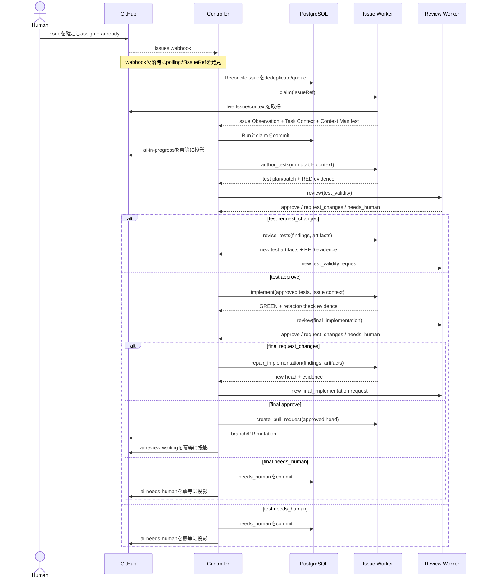
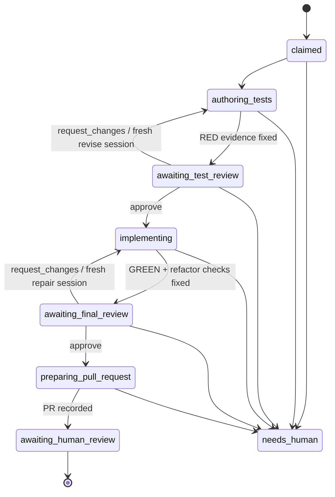

# End-to-end workflow

## Purpose

本書は、人間が Task Issue を準備してから、Kudo が Pull Request を作成し、人間の review へ引き渡すまでの規範的な順序を定義する。外部 protocol の field は [Issue Contract](contracts/issue-contract-v1alpha1.md) と [Implementation–Review Protocol](contracts/review-protocol-v1alpha1.md)を正とする。

## Actors

- Human Author: Issue Contract を完成させ、`mrbaron3`を assign し、`ai-ready`で実行を依頼する。
- Controller: 候補を reconcile し、状態遷移を検証し、Operation を dispatch し、GitHub status を投影する。model session は持たない。
- Issue Worker: implementation 側の唯一の writer。専用 worktree、branch、test、source、commit、Pull Request を変更できる。
- Review Worker: read-only checkout と immutable artifact から test validity と最終実装を判定する。implementation の source、branch、PR を変更できない。
- GitHub: live Issue、repository、Pull Request の source of truth。
- PostgreSQL: Run、Operation、lease、inbox/outbox、projection intent の authoritative workflow store。

## Preconditions

人間は `.github/ISSUE_TEMPLATE/kudo-task.md` を使い、次を満たす。

1. required section と Contract block をすべて確定する。
2. `kind: task`、`readiness: ready`にする。
3. Acceptance Criteria を観測可能な Given/When/Then で書き、ID を Contract block と一致させる。
4. 参照すべき仕様を`authorityRefs`へ優先順位の高い順に列挙する。
5. `mrbaron3`を assign する。
6. 最後に`ai-ready`を付ける。

`ai-ready`は契約内容ではなく、完成した契約に対する one-shot execution request である。

## Normal flow

### 1. Discovery and reconciliation

Webhook adapter は署名を検証し、delivery ID と IssueRef を durable inbox に記録する。定期 poller は起動時と既定60秒ごとに、configured repository の open Issue を検索する。どちらも同じ`ReconcileIssue(IssueRef, Trigger)`を起動し、payload 内の Issue body を実装入力にしない。

Reconciliation は live GitHub state で candidate 条件を確認する。条件を満たさない Issue は`skipped_not_candidate`として終了し、失敗や escalation にしない。

### 2. Claim

Controller は IssueRef に対する短い claim lease を取得し、Issue Worker へ claim Operation を dispatch する。Issue Worker は GitHub から現在の Issue を直接取得し、Contract、native relationship、dependency、authority、base commit を検証する。

claim 成功時は、Run、Issue Observation、Task Context、Context Manifest、Execution Policy、base SHA を一つの durable transition として確定する。その後、outbox から`ai-ready`と古い status label を外し、`ai-in-progress`を付ける。GitHub projection が一時的に失敗しても Run を巻き戻さない。

### 3. Test authoring and RED

Issue Worker は fresh provider session で`author_tests`を実行する。session には live Issue Observationと一致するcanonical Task Context、Context Manifestが参照するauthority content、base/head SHA、明示されたpolicyだけを渡す。raw Issue bodyは監査・live変更検知用であり、model inputへ重ねて渡さない。

test plan は各 Acceptance Criteria と test case の対応を示す。テストを追加した head で規定 command を実行し、対象機能の欠如に起因する期待どおりの failure を RED evidence として固定する。環境故障、compile infrastructure failure、無関係な既存 failure を RED とみなさない。

Issue Worker は test-only checkpoint commit、patch、command、exit status、stdout/stderr、environment identity を artifact manifest に記録する。RED が成立しなければ review へ進めない。

### 4. Test validity review

Controller は immutable input から`test_validity` Review Request を作る。Review Worker は fresh session と別の read-only checkout を使い、canonical Task Context、Acceptance Criteria、test plan、test patch、RED evidence を評価する。

- `approve`: 承認対象 digest を固定し、implementation へ進む。
- `request_changes`: blocking finding を versioned Result として返す。Controller は同じ Run/worktree を所有する Issue Worker の新しい`revise_tests` session へ finding と artifact を渡す。
- `needs_human`: 自動修正できない authority または安全判断として workflow を停止する。

「元の作業へ差し戻す」とは同じ論理 lane と worktree を使うことであり、以前の provider conversation を resume することではない。修正後は新しい head、artifact manifest、Review Request を作り、再 review する。

### 5. GREEN and refactor

test validity approval 後にだけ、Issue Worker は fresh`implement` session を開始する。入力はcanonical Task Context、approved test/result、現在head、Context Manifestであり、raw Issue body、test authorまたはreviewerのtranscriptではない。

implementation は次を順に満たす。

1. 承認済み test を変更せずに production code を実装する。
2. 対象 test と必要な回帰 test を通し、GREEN evidence を固定する。
3. behavior を保ったまま重複、命名、構造を refactor する。
4. Issue の Verification と repository の required checks を再実行する。
5. test 変更が必要になった場合は implementation 中に書き換えず、test authoring/review gate へ戻す。

### 6. Final implementation review

PR 作成前に、Controller は final head、approved test review、implementation patch、GREEN/refactor/check evidence を固定し、`final_implementation` Review Request を発行する。Review Worker は fresh read-only session で correctness、regression、scope、risk、evidence を評価する。

`request_changes`は fresh`repair_implementation` session へ handoff し、修正後の head に新しい review を要求する。head または artifact が変われば以前の approve は stale である。`needs_human`は自動 loop を停止する。

### 7. Pull Request handoff

final approve と required checks が同じ head に bind されている場合だけ、Issue Worker が branch を push し、Pull Request を冪等に作成または更新する。PR body は `.github/pull_request_template.md` の必須項目を満たし、少なくとも次を含む。

- Task Issue link と closing keyword
- outcome と変更範囲
- RED / GREEN / refactor 後 verification の command、結果、artifact reference
- test validity と final implementation の Review Result reference
- Acceptance Criteria との対応
- 残存 risk と人間が確認すべき事項
- Run ID、base SHA、head SHA

PR の作成が durable に記録された後、Controller は`ai-in-progress`を外し、`ai-review-waiting`を付ける。これが Kudo の正常 handoff terminal である。merge、Issue close、PR review comment への対応はこの workflow の外に置く。

## Durable states

上図は Run phase を表す。retry 可能な transport/execution failure は quality state ではなく Operation の`retry_wait`として記録し、backoff 後に同じ logical Operation を新しい execution attempt で実行する。provider session は retry ごとに新規作成する。

## Escalation and resumption

`needs_human`では、Controller が理由、停止 phase、必要な対応、evidence reference を永続化してから`ai-needs-human`と日本語 comment を投影する。人間は Issue 本文または明示された authority を修正し、再度`ai-ready`を付ける。

再 reconciliation では入力 digest を比較する。入力が同じで単に外部設定が復旧した場合は安全な checkpoint から同じ Run を再開できる。Issue、authority、base、approved artifact が変わった場合は古い Run を superseded とし、新しい Run と review lineage を作る。古い approval を新しい入力へ移し替えない。

`needs_human`は実行を停止したpaused Runであり、同時実行中のRunとは数えないが、同じIssueに新しいRunを無条件で作れる状態でもない。再reconciliationは、同じRunのresumeまたは旧Runのsupersedeと新Run作成を一つのtransactionで決め、writerを同時に二つ存在させない。

## Idempotency and recovery

- GitHub delivery ID は inbox で一意にする。
- polling と webhook は同じ IssueRef に対して同じ reconciliation rule を使う。
- 1 IssueRef に active Run は最大一つとする。
- Operation identity と execution attempt を分け、timeout 後の retry を追跡する。
- worktree/branch/PR mutation は Issue Worker の idempotency key で重複を防ぐ。
- state transition と external projection intent は同じ database transaction に記録し、outbox が GitHub へ再送する。
- process 停止で lease が失効した場合、別 worker が immutable checkpoint から Operation を再取得する。
- Run 中に Issue Observation、authority digest、base/head が変われば進行を止め、以前の review を stale にする。
